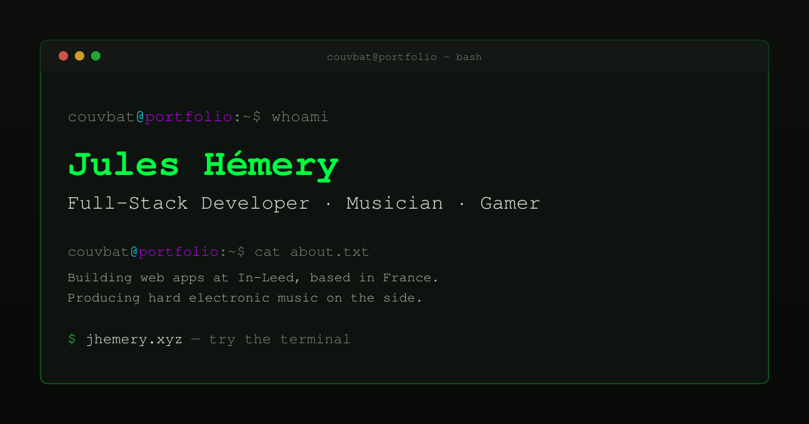

<div align="center">

<a href="https://jhemery.xyz"></a>

# jhemery.xyz

The personal portfolio of **Jules Hémery** (*Couvbat*): a terminal-flavoured site over a wireframe
three.js background. It has a real shell you can type into, seven games, a page of in-browser
tools, watch-party and radio rooms, and 37 hidden achievements. English and French throughout.

[](https://github.com/Couvbat/jhemery/actions/workflows/frontend-pr-check.yml)
[](https://github.com/Couvbat/jhemery/actions/workflows/backend-pr-check.yml)
[](LICENSE)


**[jhemery.xyz](https://jhemery.xyz)** · press <kbd>`</kbd> to open the terminal · or try `curl jhemery.xyz`

</div>

---

## Contents

- [Highlights](#highlights)
- [Quick start](#quick-start)
- [Repository layout](#repository-layout)
- [The page](#the-page)
- [The terminal](#the-terminal)
- [Commands](#commands)
- [Games](#games)
- [Tools](#tools)
- [Achievements](#achievements)
- [The API](#the-api)
- [Testing](#testing)
- [CI and deployment](#ci-and-deployment)
- [Contributing](#contributing)
- [Documentation](#documentation)
- [Word lists and attribution](#word-lists-and-attribution)
- [Licence](#licence)

## Highlights

- 🖥️ **A real shell.** About 70 commands, plus aliases, with Tab completion, history, `alias`, a
  working modal `vim` and a "did you mean…?" for typos. The terminal and the page read the same
  content modules, so they can't contradict each other.
- 🔺 **A reactive three.js background.** Wireframe polyhedra pull towards the pointer, change
  colour with each section, react to the weather where I am and can be driven from the shell. The
  whole field swings like a prism when you change page.
- 🎨 **Colour schemes from r/unixporn.** `theme` swaps the neon for Gruvbox, Nord, Dracula,
  Catppuccin, Tokyo Night, Rosé Pine, Everforest or Solarized. The wireframes, glows and confetti
  follow. Two schemes are light, and picking one is an achievement in itself.
- 🎮 **Seven games in the output buffer:** `2048`, `snake`, `minesweeper`, `tetris`, `wordle`,
  `hangman` and `wpm`. The word games use real bilingual word lists.
- 🧰 **In-browser tools at `/tools`.** Image conversion, hashing, encoding, JSON, colour, time,
  passwords, text stats and an `ffmpeg.wasm` converter. Your files are never uploaded.
- 📺 **Watch party and radio rooms.** YouTube or SoundCloud stays in sync across everyone in a
  five-character room, over SSE.
- 🏆 **37 achievements** for finding the hidden layer, each announced with a burst of monospace
  confetti.
- 🌐 **Live data** from Steam, GitHub, CI runs, the weather and crypto prices, plus live presence,
  a guestbook and a self-hosted LLM behind `ask`. Every integration degrades gracefully when it's
  switched off.
- 🔒 **Privacy by construction.** Presence is one anonymous integer, stats count sessions rather
  than commands, `ask` logs nothing, analytics are self-hosted and cookieless.
- 📄 **One source for the CV.** `curl jhemery.xyz` returns an ANSI-coloured résumé that is
  generated at build time from the same content the page renders.

## Quick start

Requires **Node ^20.19 or ≥ 22.12**. There's no root `package.json`: the frontend and the backend
are independent npm projects.

```bash
# frontend: http://localhost:5173
cd frontend
npm install
npm run dev
```

```bash
# backend: http://localhost:3000
cd backend
npm install
cp .env.example .env
npm run start:dev
```

`frontend/.env.development` already points `VITE_API_URL` at `http://localhost:3000`. The site
also runs with the API down; the live cards just say so. An empty backend `.env` boots too, and
every optional feature reports itself as unconfigured. [`backend/.env.example`](backend/.env.example)
documents every variable, including why the risky ones ship disabled.

## Repository layout

```
frontend/   Vue 3 + Vite + Tailwind 4 SPA: sections, terminal, games, tools, rooms, PWA
backend/    NestJS 11 API: ask, contact, steam, github, weather, markets, presence,
            stats, guestbook, rooms, jobs
docs/       features spec, roadmap, deployment guide, per-feature design specs and plans
.github/    PR checks, builds, SSH deploys with an FTP fallback, Dependabot
```

Each app has its own README for working on its code:
[frontend/README.md](frontend/README.md) and [backend/README.md](backend/README.md).

---

## The page

| Feature | Notes |
|---|---|
| **three.js background** | 18 wireframe polyhedra (icosahedron, torus, box, octahedron, tetrahedron, dodecahedron) rotating slowly. Three are in an accent colour and the rest in the base colour, both taken from the `--neon-*` CSS custom properties. The camera eases towards the pointer for a parallax tilt. |
| — pointer gravity | Shapes within ~5 world units of the cursor lean towards it, most strongly at the centre. They drift back once the pointer leaves or has been idle for 2.5 s. |
| — section-reactive | Each section has its own palette and rotation speed: green for *about*, cyan for *projects*, purple for *music*, pink for *gaming*, and so on. Materials are recoloured in place, so shapes keep their positions across a section change. |
| — glitch burst | The flag that drives the CSS screen-tear on `sudo rm -rf /` also shakes the wireframes, for exactly as long. |
| — 100% palette | Unlocking every achievement switches the background to a pink/cyan palette that no section uses. |
| — click to inspect | Clicking a wireframe shows its name (`icosahedron · 20 faces`) and turns the camera towards it for a couple of seconds. Clicks on links, controls and text selections are ignored. |
| — terminal control | `spawn`, `gravity on\|off`, `constellation on\|off` and `scene reset` drive the background from the shell. The shape count is capped at 60. |
| — constellation | Draws lines between shapes that are closer than 5.5 world units, recomputed each frame into a pre-allocated buffer. |
| — weather mood | The real weather nudges it: a storm speeds the wireframes up, fog dims them, snow slows them and night dims them a little more. These are small multipliers on the section palette, never a replacement for it. |
| — view swing | Changing page rotates the wireframe field about its centre while the camera pulls back and every shape moves to a new position. The rotation runs on a `THREE.Group`, not the camera, and is folded back into the positions at the end so the gravity maths stays correct. |
| — performance | The component is `defineAsyncComponent`'d and only loaded on `requestIdleCallback`, so ~520 kB of three.js never competes with first paint. It is excluded from the PWA precache for the same reason. |
| — accessibility | `prefers-reduced-motion` skips loading it entirely. WebGL failures are caught and leave the canvas blank. Geometries, materials and the renderer are disposed on unmount. |
| **Sections** | about · projects · music · gaming · hardware · contact. They are defined once in `src/content/sections.ts` and read by the navbar, the terminal's `ls`/`cd`/`pwd`, the command palette and every section header. |
| **Views** | home · tools · watch · radio. These are the routes, defined once in `src/content/views.ts` in the order they sit on the prism. The navbar, `cd` and <kbd>Ctrl</kbd>+<kbd>K</kbd> all navigate through the same `goTo()`, which goes home first when you ask for a section from another page. |
| **Prism swing** | Changing view turns the page like a face of a prism whose axis runs through the centre of the three.js scene. The old page rotates out and the new one rotates in from the same side, in 3D CSS on a fixed, clipped stage, over 650 ms. The navbar and launcher stay put. Going back turns the other way. Under `prefers-reduced-motion` the pages simply swap. It works without three.js loaded. |
| **CRT overdrive** | `crt` in the terminal, or the Konami code anywhere on the page, toggles scanlines and flicker, and speeds up the wireframes. The setting is saved in `localStorage`. |
| **Colour schemes** | `theme` lists eleven schemes with a swatch strip each, and `theme <name>` (or `theme random`) applies one: the site's own *cyberpunk* default, plus Gruvbox (dark and light), Nord, Dracula, Catppuccin (Mocha and Latte), Tokyo Night, Rosé Pine, Everforest and Solarized. A scheme is a table of a dozen colours in `src/lib/themes.ts`, and every CSS token is derived from it. That means the glows, the three.js wireframes, the confetti and `neofetch`'s colour strip all follow along. Going back to the default removes every override, so the stylesheet stays the default's only definition. Switching from a dark scheme to a light one whites the screen out for a moment (skipped under reduced motion). The choice is saved in `localStorage` and applied before the app mounts. A unit test holds every scheme to WCAG contrast floors. |
| **Boot sequence** | A fake `couvsh 1.0` kernel log plays on your first visit. `reboot` replays it on demand, and `ssh` ends by triggering it. Skipped under reduced motion. |
| **Status ticker** | The footer shows the uptime `neofetch` reports (days since the first commit) and how long ago this build shipped. It refreshes slowly, so a tab left open stays accurate. |
| **Live presence** | The footer also shows how many people are on the site right now, over SSE. It's a single count and nothing else (see [the API](#the-api)). |
| **Live cards** | Steam "currently playing", recent GitHub commits, the latest CI runs, a contribution heatmap and pinned repos, a SoundCloud player and the guestbook. |
| **Guestbook ticker** | A 20 s poll (not SSE; see [the spec](docs/features-spec.md#8-backend-additions)) shows a floating notice when someone signs while you're on the page. Clicking it opens `guestbook`. It pauses while the tab is hidden and stops if the guestbook is off. |
| **Command palette** | <kbd>Ctrl</kbd>/<kbd>⌘</kbd>+<kbd>K</kbd> opens a fuzzy list of views, sections and palette-flagged commands. It's keyboard-navigable and keeps the selection in view. |
| **Matrix rain** | `matrix` follows the white rabbit. The effect component is lazy-loaded on demand. |
| **i18n** | English and French. The language comes from `navigator.language` and can be changed with the navbar toggle or `lang en\|fr`. It's saved in `localStorage`. All content and every terminal string is `Localised<T>`. |
| **PWA** | Installable, with an `autoUpdate` service worker, maskable icons and an offline navigation fallback. |
| **`curl jhemery.xyz`** | A Vite plugin generates an ANSI-coloured `resume.txt` from `src/content` at build time, so the résumé has exactly one source. LLM crawlers get the same file. |

## The terminal

Open it with <kbd>`</kbd> anywhere (or <kbd>Ctrl</kbd>+<kbd>`</kbd> from inside a form field), or
with the `>_ terminal` button in the bottom-right corner. It's desktop only: fixed input panels
work badly with mobile virtual keyboards, and the page itself shows the same content anyway.

| Key | Does |
|---|---|
| <kbd>Tab</kbd> | Completes to the longest common prefix. First commands and your own aliases, then their arguments: filenames for `cat`/`vim`/`diff`, sections and pages for `cd`/`ping`, tool names, scheme names for `theme`, `on`/`off` for the background toggles |
| <kbd>↑</kbd> / <kbd>↓</kbd> | Command history (saved between visits) |
| <kbd>Ctrl</kbd>+<kbd>L</kbd> | Clear |
| <kbd>Ctrl</kbd>+<kbd>C</kbd> | Cancel a running command |
| <kbd>Esc</kbd> | Close the overlay (focus goes back where it was) |
| traffic lights | The title-bar dots really do close, minimise and maximise |

An unknown command gets a "did you mean …?" suggestion when it is one edit away (a swapped pair of
letters counts as one), or two for names of six letters or more. `help` groups commands
into *shell · navigation · content · live data · misc* and only hints that "not everything is
listed here". `help --all` reveals the hidden ones.

**vim.** `vim` (or `vi`, `nvim`, `emacs`) opens a real modal editor pane with normal and insert
modes, `hjkl` and the arrows, `i`/`a`/`A`/`o`, `x` and `dd`. And yes, `:q!` gets you out. `:q`
refuses once you've typed something, just like the real thing. The red title-bar dot always works
if you'd rather not play along. `cat` and `vim` read from the same fake filesystem, so a file can
never show two different contents.

## Commands

<details>
<summary><b>shell</b>: help, clear, history, echo, lang, theme, exit…</summary>

| Command | Aliases | Usage |
|---|---|---|
| `help` | `?`, `man` | `help [command] [--all]`: list commands, or explain one |
| `clear` | `cls` | Clear the screen |
| `history` | | Show command history |
| `echo` | | `echo <text>` |
| `date` | | Current date |
| `whoami` | | Print the current user |
| `lang` | | `lang [en\|fr]`: show or switch language |
| `theme` | `colorscheme` | `theme [name\|random]`: list the colour schemes, or switch to one |
| `exit` | `quit`, `logout` | Close the terminal |

</details>

<details>
<summary><b>navigation</b>: ls, cd, pwd, cat, diff, ping, open, tools</summary>

| Command | Usage |
|---|---|
| `ls` | `ls [-a] [path]`: list sections, pages and files (`-a` shows more than you were meant to see). `ls tools` lists the tools |
| `cd` | `cd <section>` scrolls there, routing home first if you're on another page. `cd tools` and `cd tools/<tool>` open the tools page or a single tool. `cd watch/<code>` and `cd radio/<code>` join a room. `cd`, `cd ~` and `cd /` go home |
| `pwd` | Print where you are: `/home/couvbat/projects` on the page, `/home/couvbat/tools/image` with a tool open, `/home/couvbat/watch/AB3DE` in a room |
| `tools` | `tools [<tool>]`: list the tools with their descriptions, or open one |
| `cat` | `cat <file>`: `about.txt`, `skills.txt`, `contact.txt`, guestbook entries, … |
| `diff` | `diff <file> <file>`: unified line diff of any two files in the fake filesystem |
| `ping` | `ping <section\|page>`: four fake round trips, then it actually goes there |
| `open` | `open <github\|linkedin\|soundcloud\|steam\|email>` |

</details>

<details>
<summary><b>content</b>: about, skills, projects, neofetch, resume, curl…</summary>

| Command | Aliases | Does |
|---|---|---|
| `about` | `bio` | Who I am |
| `skills` | | Tech I work with |
| `projects` | | What I've built. `projects --json` gives a machine-readable version |
| `music` | | What I produce |
| `gaming` | | What I play |
| `hardware` | | `hardware [pc\|nas\|peripherals]` |
| `contact` | `links` | How to reach me |
| `neofetch` | `fetch` | System summary with an ASCII logo and an "uptime" counted from the first commit |
| `resume` | `cv` | Condensed résumé |
| `curl` | | `curl jhemery.xyz` fetches the résumé the way a real curl would |

</details>

<details>
<summary><b>live data</b>: steam, gitlog, weather, btc, guestbook, mail, ask</summary>

| Command | Aliases | Does |
|---|---|---|
| `steam` | `playing` | Live Steam activity |
| `gitlog` | `git log`, `commits` | Recent public commits |
| `weather` | `wttr` | Current conditions where I am, wttr.in-style, plus a two-day forecast |
| `btc` | `stonks`, `crypto` | Crypto prices with a 7-day ASCII sparkline. Not financial advice |
| `guestbook` | `gb` | Read what visitors left. Entries are listed as files you can `cat` |
| `sign` | | `sign <message>` leaves a message |
| `mail` | `sendmail`, `write` | Send me a message without leaving the terminal |
| `ask` | | `ask <question>` streams an answer from a self-hosted LLM |

</details>

<details>
<summary><b>misc</b>: games, achievements, play, background control</summary>

- **Games:** `games` (`arcade`), `2048`, `snake`, `minesweeper` (`mines`), `tetris`, `wordle`
  (`motus`), `hangman` (`pendu`), `wpm` (`typing`). See [Games](#games).
- **Progress:** `achievements` (`trophies`) prints the same list as the trophy modal.
- **Music:** `play` scrolls to the music section and starts the player.
- **Background control:** `spawn [n]`, `gravity [on|off]`, `constellation [on|off]` (`stars`) and
  `scene [reset]`.

</details>

<details>
<summary><b>hidden</b>: spoilers, only listed by <code>help --all</code></summary>

`sudo`, `matrix`, `reboot` (`restart`), `ssh`, `whois`, `crt`, `vim` (`vi`/`nvim`/`emacs`), `:q`
(`:q!`/`:wq`/`:x`/…), `hack`, `coffee` (`brew`), `cowsay`, `fortune`, `sl`, `rickroll`, `banner`,
`uname`, `ps` (`ps aux`/`ps -ef`), `top` (`htop`), `env` (`printenv`/`export`), `alias`,
`unalias`, `gravity`, `spawn`, `constellation`, `scene`.

`alias gl='git log'` names your own commands, saved in `localStorage`. `unalias <name>` removes
one.

Two files never appear in a plain `ls`: `.secret`, and a `.env` full of credentials that are as
fake as they look. `ls -a` lists both, and `cat` and `vim` can read them.

`sudo -i` asks for the admin password and unlocks the owner-only [downloader](#tools).

</details>

## Games

All seven run inside the terminal buffer and take over the keyboard while they're running.
**<kbd>Esc</kbd> or <kbd>Ctrl</kbd>+<kbd>C</kbd> quits any of them.** That's the universal exit
because three of the games read letters, so they can't use `q` for it. Best scores are kept per
game in `localStorage` and shown by `games`.

| Game | Controls | Notes |
|---|---|---|
| **`2048`** | Arrows or `wasd`, `r` restarts | Slide tiles and merge them. |
| **`snake`** | Arrows or `wasd` | Eat, grow, mind the walls. With reduced motion there's no clock: the snake moves one step per keypress. |
| **`minesweeper`** (`mines`) | Arrows/`wasd` move, <kbd>Space</kbd> reveals, `f` flags | 16×10 with 25 mines. The first reveal is never a mine. Scored on time, so this is the one game where a *lower* number is better. |
| **`tetris`** | Arrows/`wasd` move and rotate, <kbd>Space</kbd> hard-drops | 10×18 well, no speed curve. With reduced motion, each keypress drops the piece one row, so it falls exactly as fast as you play. |
| **`wordle`** (`motus`) | Type, <kbd>Backspace</kbd>, <kbd>Enter</kbd>, `r` for a new word | Five letters, six tries. The word list follows the site's language, and accents are folded, so you can type `EPEE` for `ÉPÉE`. Scored on solve streak. |
| **`hangman`** (`pendu`) | Type a letter | Six wrong guesses, same bilingual word list. Guessing a letter again doesn't cost a life. Scored on win streak. |
| **`wpm`** (`typing`) | Type, <kbd>Backspace</kbd> corrects | Type a line of random common words and get your words per minute and accuracy. A character you got wrong still counts against accuracy after you correct it. |

## Tools

`/tools` is a second page of small utilities that run **entirely in the browser**. Nothing you
drop on the page is uploaded, because there's no server on the other end. You can reach it from
the navbar, `cd tools`, `tools` or <kbd>Ctrl</kbd>+<kbd>K</kbd>. Each tool is its own lazy chunk,
opened at `/tools/<name>` (or `cd tools/<name>`), and keeps its logic in a plain `.ts` file next
to its panel, with its own tests.

| Tool | Does |
|---|---|
| **`image`** | Converts between PNG, JPEG and WebP, resizes to a maximum width, and sets the quality. Re-encoding through a canvas drops EXIF, GPS and colour-profile data by construction. When a browser can't write the requested format (Safari and WebP), the tool says so and names the file after the format it actually produced. |
| **`hash`** | SHA-1, SHA-256 and SHA-512 of some text or a dropped file, in hex or base64, using Web Crypto. |
| **`encode`** | Base64 (UTF-8 safe, accepts the URL-safe alphabet and missing padding), URL encoding and hex, in both directions. Malformed input is reported rather than guessed at. |
| **`json`** | Pretty-prints with 2, 4 or tab indentation, or minifies. Invalid JSON is reported with its line and column and a caret under the offending character. It uses its own scanner, because `JSON.parse`'s messages no longer include a position. |
| **`colour`** | Takes hex, `rgb()`, `hsl()` or `oklch()` and outputs all four. Shows the WCAG contrast ratio and level against a second colour and against every token in the site's own palette, read live from the stylesheet so it always matches the theme. |
| **`time`** | Converts an epoch in seconds or milliseconds, an ISO 8601 date or `now` into all of those. Also shows your time zone, a relative phrase (*in 3 days*), the ISO week and day of the year, and the same instant in nine time zones with their offsets. |
| **`password`** | Random passwords with a length slider and character classes (look-alikes optional), or diceware passphrases drawn from the typing game's word lists. Shows the entropy in bits and a grade. Generated locally with `crypto.getRandomValues` and never stored. |
| **`text`** | Word, character, line, sentence and paragraph counts, UTF-8 bytes, reading and speaking time, and the most frequent words. Also converts case: title, sentence, camel, pascal, snake, kebab, constant, and slug with accents folded. |
| **`ffmpeg`** | The one tool with a dependency: ffmpeg compiled to WebAssembly. Converts to mp3, m4a, ogg, wav or flac, extracts the audio stream without re-encoding, re-encodes video to H.264 mp4, makes palette-optimised GIFs, and trims any of these. The 32 MB core is only downloaded when you press the button, from this site's own `/assets/`, and then stays in the browser cache. Input is read in place from disk, so multi-gigabyte files work. It's single-threaded, so video is slow, but audio isn't. |
| **`download`** | The owner's tool, and the only one with a server behind it. yt-dlp on the server turns one YouTube video or one SoundCloud track into an mp3. It runs as a *job* that the page polls, and the file is handed over once and then deleted. The tool stays hidden until `sudo -i` (or the panel's own field) unlocks it with the admin password. It never accepts a playlist, set or profile: fetching a whole profile is what got the server's IP blocked for an hour. See [deploy.md](docs/deploy.md#what-the-shell-can-run--facts-for-the-downloader). |

The page, the `tools` command and Tab completion all read `src/tools/registry.ts`. Adding a tool
means adding one object there, plus the tool's folder.

**Rooms.** `/watch` and `/radio` are the third and fourth faces of the prism. A room is a
five-character code. The host pastes a YouTube link (watch) or queues SoundCloud tracks and sets
(radio), and every guest's player follows the host's play, pause and seeks to within two seconds,
correcting for drift against the server's clock. Both embeds are controlled over `postMessage`, so
no YouTube or SoundCloud script runs on the page, and the CSP only needs one extra `frame-src`.
Rooms are off unless the API sets `ROOMS_ENABLED`.

## Achievements

There are 37 achievements, tracked in `localStorage` (`couvbat:achievements`, plus
`couvbat:achievements:sections` for the exploration one and `couvbat:achievements:themes` for the
colour-scheme one). Unlocking one shows a floating toast with a burst of monospace-glyph confetti
(skipped under `prefers-reduced-motion`) and prints a line in the terminal. The trophy button in
the navbar opens a modal listing all 37: locked ones show `???` and a vague hint, and unlocked
ones show their title and how you got them. `achievements` (`trophies`) prints the same progress
in the terminal.

The last one unlocks itself once you have the other thirty-six. When it does, the three.js
background changes palette.

<details>
<summary><b>Spoilers: how to unlock each one</b></summary>

| Achievement | How to get it |
|---|---|
| Read the Manual | `ls -a`, then `cat .secret` |
| Grand Tour | `cd` into every section |
| Kilroy Was Here | Sign the guestbook with `sign <message>` |
| You've Got Mail | Send a message with `mail` |
| Turing Test | Get an answer out of the local model with `ask` |
| Bilingual | Switch language with `lang` |
| Script Kiddie | Run `sudo rm -rf /` |
| Vi Improved | Escape vim with `:q!` |
| Red Pill | `matrix`: follow the white rabbit |
| 1337 h4x0r | `hack` the mainframe |
| Bovine Wisdom | `cowsay <text>` |
| Fortune Cookie | `fortune` |
| Choo Choo | Mistype `ls` as `sl` |
| I'm a Teapot | `coffee` |
| Never Gonna | `rickroll` |
| CRT Overdrive | Toggle `crt` |
| Task Manager | Watch `htop` |
| Cheat Code | Enter the Konami code (↑↑↓↓←→←→BA) anywhere on the page, no terminal needed |
| Tile Merchant | Reach a 256 tile in `2048` |
| Nokia Nostalgia | Grow a snake to length 10 in `snake` |
| Clean Sweep | Clear a board in `minesweeper` |
| Word Play | Solve a `wordle` |
| Last Word | Win a round of `hangman` |
| Touch Typist | Hit 60 wpm at 95%+ accuracy in `wpm` |
| Line Clear | Clear 10 lines in one game of `tetris` |
| Configuration Leak | `cat .env` (or open it in `vim`) |
| Deja Vu | Replay the boot sequence with `reboot` |
| Knock Knock | `ssh couvbat@jhemery.xyz` |
| Spot the Difference | `diff` two files |
| Make It Yours | Define an `alias` |
| Big Text Energy | `banner <text>` |
| Rare Find | Click one of the three accent-coloured wireframes |
| Connect the Dots | `constellation on` |
| Zero-G | `gravity off` |
| Ricer | Apply five different colour schemes with `theme` (they count across visits) |
| Flashbang | Switch to a light scheme: `theme gruvbox-light` or `theme catppuccin-latte` |
| 100% | Unlock everything else |

</details>

## The API

NestJS, with CORS restricted to `FRONTEND_URL`, a global whitelisting validation pipe, a
`default-src 'none'` CSP (it's a JSON API, never a document), and `trust proxy` enabled so the
per-IP rate limiter sees real clients behind Apache.

| Route | Purpose |
|---|---|
| `POST /ask` | Proxies an OpenAI-compatible runtime (Ollama, llama.cpp, vLLM, LM Studio). 5 questions/hour per IP, one request in flight globally, ~300 output tokens, 20 s timeout. Questions and answers are never logged. **Off by default.** |
| `POST /contact` | Sends the `mail` command's message over SMTP (only logged, in dev). |
| `GET /steam/activity` | Currently playing and recently played, from the Steam Web API. |
| `GET /github/activity` | Recent public commits. |
| `GET /github/contributions` | Contribution heatmap (GraphQL, needs a token). |
| `GET /github/pinned-repos` | Pinned repositories (GraphQL, needs a token). |
| `GET /github/workflow-status` | The four most recent Actions runs for `GITHUB_REPO`. Uses the public REST API, so the token is optional. Cached for only 60 s, because a build in progress is the one case where a stale answer is wrong. |
| `GET /weather` | Current conditions and a short forecast from Open-Meteo (no key, no account). The coordinates are **mine**, from server config. Nothing about the visitor is read or sent, so everyone gets the same answer and one 10-minute cache serves them all. |
| `GET /markets` | Crypto quotes and a 7-day series from CoinGecko (no key, no account). It's a proxy only because CORS blocks the browser from calling CoinGecko directly. The coin list is server config, so no visitor data is forwarded. Cached for 5 min. |
| `GET /presence` | Server-sent events giving how many people are on the site right now. It's one integer, pushed as visitors arrive and leave. No visitor ID is sent or assigned, and nothing is stored. |
| `GET /stats` · `POST /stats/session` | A single running total of terminal sessions. Counted once when you open the shell, never per command, so the server never learns which commands anyone runs. 5/hour per IP. |
| `GET /guestbook` · `POST /guestbook` | Read and sign. Sanitised, link-filtered, 1/min per IP, capped at 500 entries. Stored in a JSON file under `DATA_DIR`, or in MongoDB if `MONGODB_URI` is set. **Off by default.** |
| `DELETE /guestbook/:id` | Moderation. Requires the `x-admin-password` header. |
| `GET /rooms` · `POST /rooms` | Whether rooms are enabled, and creating a watch or radio room. Creating one returns a five-character code and a host token that is never sent again. 10 rooms/hour per IP, 200 rooms at most, all in memory. **Off by default.** |
| `GET /rooms/:code` · `GET /rooms/:code/events` | A room's snapshot, and the SSE stream every member keeps open: the host's playback state tied to the server clock, the queue, and a head count. As with `/presence`, it's a number, never a list of who's there. |
| `POST /rooms/:code/state` · `DELETE /rooms/:code` | Changing the room's state and closing it, host only (`x-room-token`). What a host can load is allowlisted on the server: an eleven-character YouTube ID or an https soundcloud.com URL. Nothing else can reach a guest's iframe. 120 state changes/min per IP. |
| `GET /jobs` · `POST /jobs` | Owner only (`x-admin-password` on every route). Returns the downloader's state, or starts a job for one YouTube video or one SoundCloud track. URLs must match an allowlist, and sets and profiles are refused. yt-dlp runs on the server in the background, and the request returns immediately with a job ID. 20/hour per IP, at most three pending and one running, ten minutes per job. **Off by default.** |
| `GET /jobs/:id` · `GET /jobs/:id/file` · `DELETE /jobs/:id` | Poll a job, fetch its file (once: it's deleted as soon as the download completes, or 30 minutes after it was produced), or cancel/dismiss it. |

**Everything optional degrades gracefully:**

- No Steam key hides live activity.
- No GitHub token drops the heatmap and pinned repos, and no `GITHUB_REPO` drops the build-status
  card.
- An unreachable model makes the terminal say it's asleep and suggest `mail`.
- With rooms off, the watch and radio pages say so.
- With the downloader off, its panel says so once unlocked.

Endpoints report `configured: false` rather than returning an error.

## Testing

```bash
cd frontend && npm test            # vitest + jsdom: registry, every command, games, tools, i18n, content purity
cd frontend && npm run test:e2e    # Playwright: builds and serves dist/, every API call stubbed
cd frontend && npm run lint        # ESLint
cd frontend && npm run type-check  # vue-tsc
cd frontend && npm run lighthouse  # Lighthouse CI against the budgets in lighthouserc.yml

cd backend && npm test             # Jest, *.spec.ts next to each module
cd backend && npm run test:e2e
cd backend && npm run lint         # eslint --fix
```

Behaviour is tested in the Vitest suite, which runs in seconds. The Playwright suite only covers
what jsdom can't: that async chunks load, that failed live data degrades instead of throwing, that
anchors scroll a real viewport, and that `/resume.txt` and similar files get past the SPA
fallback. It never contacts a real backend: every call is stubbed against an unreachable origin,
so a missing stub fails loudly.

## CI and deployment

The site runs on shared o2switch hosting (Apache and CloudLinux Passenger), deployed from GitHub
Actions.

| Workflow | Runs on | Does |
|---|---|---|
| `frontend-pr-check.yml` | PRs into `master` or `dev`, and pushes to `dev` | Lint, unit tests, type-check and build, then Playwright, then Lighthouse budgets (median of five runs) |
| `backend-pr-check.yml` | Same | Lint, tests, build |
| `*-build.yml` | Pushes to `master` touching that app | Production build. The frontend build fails if `VITE_API_URL` is unset |
| `*-deploy.yml` | Pushes to `master` touching that app | Adds the runner's IP to the SSH whitelist through the cPanel API, rsyncs, and removes exactly that entry afterwards. The backend runs `npm ci` and restarts on the server |
| `*-deploy-ftp.yml` | Manual only | FTPS fallback for when the cPanel API is unavailable |

The PR checks deliberately aren't path-filtered. They're required status checks, and GitHub treats
a workflow that never ran as pending, not passed. `VITE_API_URL` is inlined when the site is
built, so it's a repository **variable** in CI, not a file on the server.
[docs/deploy.md](docs/deploy.md) is the full setup and troubleshooting guide.

## Contributing

This is a personal site, but the workflow is written down so it stays consistent:

- **`dev` is the integration branch.** Branch from it (`feat/…`, `fix/…`, `docs/…`) and open PRs
  back into `dev`. `master` is the release branch and only receives PRs from `dev`, opened by the
  owner. Dependabot targets `dev` too.
- **The registry is the API.** A new terminal command is one object in `src/terminal/commands/`,
  and a new tool is one entry in `src/tools/registry.ts`. `help`, Tab, the palette and `ls` pick
  them up automatically.
- **Every user-visible string is `Localised<{ en, fr }>`**, and every animation checks
  `prefers-reduced-motion`.
- **`src/content/` is imported at build time** and must stay free of Vue, the `@` alias and
  browser globals. `purity.spec.ts` enforces this.
- **Update this README** when you change a command, achievement or API route it documents.

## Documentation

| Document | What it covers |
|---|---|
| [docs/features-spec.md](docs/features-spec.md) | The design reference for the system as built: terminal core, commands, easter eggs, achievements, background, backend routes, accessibility, views and tools. Code comments cite it by section number. |
| [docs/roadmap.md](docs/roadmap.md) | The feature tracker: what was brainstormed, what shipped in which PR, known issues, and what was dropped. |
| [docs/deploy.md](docs/deploy.md) | o2switch/cPanel setup, GitHub secrets and variables, the Apache config, analytics, the downloader's server requirements, and troubleshooting notes from production. |
| [docs/superpowers/](docs/superpowers/) | Per-feature design specs and implementation plans, each with a status line and the PR it shipped in. Kept as a record of the reasoning behind each change. |

## Word lists and attribution

`wordle`, `hangman`, `wpm` and the `password` tool share one generated word list per language.
They're built by `frontend/scripts/build-wordlists.mjs` (`npm run wordlists`) and committed under
`frontend/src/terminal/games/data/`. The script is only run by hand, never at build time, so the
build works offline and CI doesn't depend on anyone else's server.

|  | answers | accepted guesses | typing pool |
|---|---|---|---|
| English | 3 497 | 6 500 | 3 527 |
| French | 969 | 5 891 | 1 261 |

English comes from **SCOWL**, which grades words by how common they are. That grading gives the
split the games want: common words are answers, and the wider set are allowed guesses. French has
no equivalent, so its list combines three sources: an MIT word array for which words exist, a
hunspell dictionary for base forms (so answers are words like `TABLE`, not conjugations like
`ABOYA`), and Tatoeba sentence frequencies for how common they are. Answers keep their accents
because they're displayed, while guesses are compared with accents folded, so `EPEES` matches
`ÉPÉES`.

The lists are ~60 kB gzipped, so they're loaded with a dynamic `import()`, one chunk per language,
the first time you run a word game. They're also kept out of the PWA precache.

| Source | Licence | Used for |
|---|---|---|
| [SCOWL](https://github.com/en-wl/wordlist), via [`wordlist-english`](https://www.npmjs.com/package/wordlist-english) | MIT | English word lists |
| [`an-array-of-french-words`](https://github.com/words/an-array-of-french-words) | MIT | Which French words exist |
| [Grammalecte / Dicollecte](https://grammalecte.net/), via [`dictionary-fr`](https://www.npmjs.com/package/dictionary-fr) (© Olivier R. and contributors) | **MPL-2.0** | French base forms |
| [Tatoeba](https://tatoeba.org/) (© Tatoeba contributors) | **CC BY 2.0 FR** | French word frequency |

The full notices, meaning the exact licence text of every data source *and* of every production
dependency, ship with the built site at [`/THIRD-PARTY.txt`](https://jhemery.xyz/THIRD-PARTY.txt).
These licences require their notice to travel with the distributed copy, which for a website is
`dist/`, not this repository. The file is generated at build time by
[`frontend/vite-plugins/third-party.ts`](frontend/vite-plugins/third-party.ts), which copies each
licence directly out of `node_modules`. A hand-written version was wrong within the hour, which is
why it's generated.

## Licence

The source code is [MIT](LICENSE). The licence doesn't cover two things, both explained in
`LICENSE`:

- the personal content (bio, photos, project write-ups, résumé text), which is mine and not
  licensed for reuse;
- the generated French word list, which is MPL-2.0 (see
  [Word lists and attribution](#word-lists-and-attribution)).
