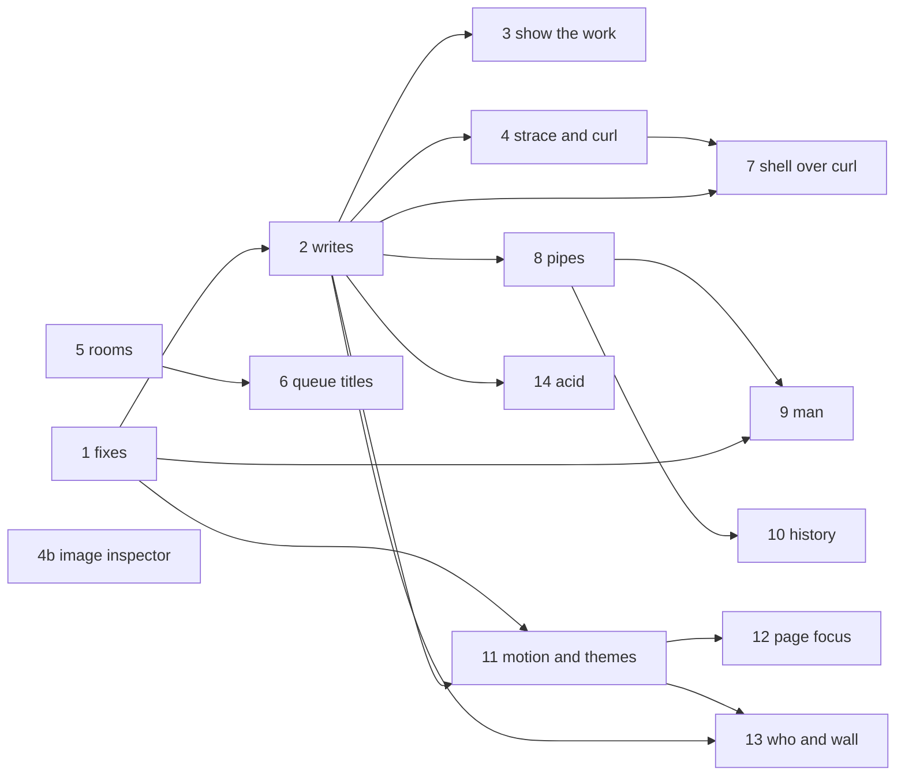

# Plan — the late-September batch (roadmap §H)

**Status: in progress.** Slice 1 is in #117, slice 2 in #118 and slice 3 on
`feat/h-show-the-work`; the rest is proposed. Written on 2026-10-01 against `dev` at `c9ef6fb`.

This plan implements [roadmap §H](../../roadmap.md#h-late-september-2026-brainstorm), whose approach
column is still the brief. Before this was written, each of the 27 rows was checked against the
source, and the draft was then reviewed against the code, the brief and `CLAUDE.md`. That turned
up three things. Several rows describe today's code wrongly, and one of them shipped before §H was
committed. Some pieces are needed by more than one row. Seven of the effort estimates are too low.
All of that comes first, so a row's builder reads it before the steps. Each branch is a PR into
`dev`.

File references are to `dev` at the commit above. Line numbers are only given where they pin a
correction; they will drift.

## What the code says that the brief doesn't

| Row | What the code says | So |
|---|---|---|
| Rate-limit key | **Already shipped** in #104 (`82d68c0`), 45 minutes before §H was committed. `trust proxy` stays at **1**, not the "hop count that matches Cloudflare → Apache". Passenger appends its own `X-Forwarded-For` line, so at 2 `req.ip` would be the spoofable entry for a request sent straight to the origin. `CF-Connecting-IP` is honoured only from Cloudflare's ranges, the bucket map is capped at 10 000, and `rate-limit.guard.spec.ts` (19 tests) passes. | Docs only. |
| Accessibility gate | The 4.04:1 failure is muted on **raised**: `bg-muted` behind `text-muted-foreground`, i.e. every window title bar (`HeroSection.vue:56-60` and about 15 more). On background the ratio is 4.44 and on surface 4.34, so stepping against those two leaves the audit red. Lighthouse only measures the default scheme, and `themeTokens()` never writes the default, which lives in `main.css`. Cyberpunk `--secondary` measures 4.17 / 4.08 and is used as small text on `/`, so it is probably a second flagged node. Eight of the eleven schemes fail muted-on-raised today. | The floors cover raised. Muted is derived when the theme table is built, so swatches show the colour that is actually painted. `main.css` is edited by hand. Read the LHCI node list before raising the gate. |
| Lazy registry + cycle guard | The cycle has three modules: `registry.ts` → `commands/index.ts` → `commands/core.ts` → `registry.ts`. The quoted error comes from entering `core.ts` first, when `commands/index.ts` spreads `coreCommands` eagerly. Building `byName` lazily fixes only the other entry order. The cycle still exists after the fix. | `commands/index.ts` also becomes a function. The guard allowlists the cycle by pattern. |
| `effects` on `Command` | `CommandContext` already has an `effects` field (`TerminalEffects`), destructured inside `run()` by matrix, reboot, crt, `:q` and play. `theme`, `lang`, `scene`, `base64` and `wordle share` write only with some arguments. `runLink` reads nothing but `linkable`. A finished but unreported daily wordle board POSTs `/stats/wordle` with no keystroke, from a linkable command. | Name the field `writes`, let it depend on the arguments, and count achievements and scores as progress rather than writes. Check it in `runLink`, and remove the unattended POST. |
| `tour` | `vim` is hidden, so a link may not run it, and naming it gives away an easter egg. A game holds the keyboard and turns the output's `aria-live` off. No API paints a scheme without saving it. `ctx.run` resets `busy`, `abortController` and `keyCapture` when the inner command ends, so after the first stop Ctrl+C can't stop the tour. | Nested runs are fixed first (slice 2). The tour shows the `games` listing rather than a game, leaves `vim` out, and adds `previewTheme()`. |
| `strace` and a real `curl` | The feed list misses `fetchJobFile` and the room streams (`rooms/useRoom.ts`, `commands/games/connect4.ts`). Two background polls go through `request()`: the guestbook ticker every 20 s, and the download tool every 1.5 s while a job moves. Either would be blamed on whatever command is being traced. `cache: 'no-store'` does not stop a service worker answering. What actually keeps the worker out is that HEAD is not routed and the `.txt`/`.xml`/`.json` files are not precached. `/` *is* precached, though. Today's `curl` prints the `resume` command and calls that "the same response a real curl gets". | Every request source goes through one observer, and background polls are tagged so strace skips them. The bare host maps to `/resume.txt`. The copy is fixed. Effort is M, not S. |
| Image inspector | WebP's extended container puts EXIF and XMP **after** the image data, and PNG text chunks may follow IDAT, so a head-only read of 256 kB misses them. JFIF APP0 is structural. jsdom has no `createImageBitmap`, so the Orientation=6 check has to be an e2e. | Read the whole file, which is already in memory, capped at 64 MB. Effort is M. |
| Pipes | Under the brief's rule, `sign l'un et l'autre` has two apostrophes that balance and would group. Free text containing `;` or `\|` (`sign great site; love it`) would post a truncated entry. Achievement toasts are ordinary output lines, so `fortune \| cowsay` would put the toast inside the cow. `&&` needs a failure signal, and `run()` returns none. Commands read `raw`, which would have to become the stage's own slice. | A word-boundary quote rule, every stage resolved before any runs, and a `stderr` flag on `OutputLine`. Effort is M–L. |
| `man` | `man` is already an alias of `help` (`core.ts:22`). Three links already hand out hidden things: `?run=help vim`, `?run=help --all`, and `?run=ls -a`, which lists the dotfiles behind two achievements. | `man` takes the alias over, and `linkable` becomes a predicate of the arguments. The predicate lands in slice 2, which also closes all three leaks. |
| History like a shell | `run()` is also reached from nested runs, while bash expands history at input time. `:q!` must stay literal. `!42` counts within the capped 100 entries `history` shows. | Expand in `submit()`, on typed lines only. |
| `who` and `wall` | SSE is one-way, so `wall` needs a `POST`. It would be the first unauthenticated route that makes every other visitor's page react. The server can't tell connections apart, so the sender has to be excluded on the client. Presence only starts on the home page: `SiteFooter.vue` is the only caller of `startPresence`. | M, not S. `wall` is off by default, and presence starts on demand. |
| Titles in the queue | A title carried in the host's patch would be arbitrary text broadcast to every guest. The current item loses its title as soon as `next()` promotes it. Changing `queue` from `string[]` to objects would crash old bundles cached by the service worker: they call `.replace` on each item, and post objects back into a `string[]` DTO. | Titles are owned by the server and travel *beside* the queue, as `titles?: Record<string, string>`. The queue stays `string[]` and old bundles ignore the new field, so neither app has to deploy first. |
| YouTube in radio | `rooms.service.spec.ts` asserts that a YouTube id is refused in radio. YouTube's terms set a 200×200 minimum for the player. Today the player is chosen once per room. | Invert that spec. The radio player is compact but at least 200 px. Choosing it per item resets the sync readings. |
| Motion control | `animate()` counts frames, so the field already runs twice as fast at 120 Hz, and a 30 fps cap would halve its speed. The brief never defines `calm`. | Make the loop delta-time based first. `calm` is defined in 11.1. Effort is M. |
| Accessible page changes | `NotFoundView` has no `<h1>`. `tabTitle()` gives the home title for `/now` and for the 404. Under reduced motion `rest()` runs before the new view renders. | |
| Case studies | The section is at `components/sections/ProjectsSection.vue`. `vitest.config.ts` defines no `__BUILD_SHA__`, so anything that pins a link to it throws under test. The `vim` study can't have a runnable *try it*, because `vim` is hidden. | |
| Design specs as pages | One spec, `2026-07-27-threejs-wireframe-background-design.md`, is in French. The frontend build and deploy workflows only watch `frontend/**`. `globPatterns` include `html` and `css`, so the notes and their stylesheet would be precached for every visitor. | |
| Experience as content | Adding a field doesn't break the v1 backend; only bumping the version does. A backend that accepts 1 or 2 removes the lockstep deploy. | |
| `why <topic>` | The phrase "Rejected alternative" appears only in the roadmap. The specs hold 17 explicit rejections, which make 13 decisions. The roadmap's own examples (battleship, mcp-sdk, polling) come from §G's departures and features-spec §8, not from the specs. | Seed from the specs, the roadmap and features-spec. |

## Settle before slice 2

These cross several rows. Agreeing them once stops each row from making its own call.

1. **The field is `writes`, not `effects`.** `ctx.effects` already exists, and
   `effects: 'local'` written next to `run({ effects })` in the same object would mislead.

   ```ts
   export type Writes = 'none' | 'local' | 'server'
   // on Command, required:
   writes: Writes | ((args: readonly string[]) => Writes)
   ```

   - `none` — the command only reads. It may still record the visitor's own progress
     (achievements, best scores, the daily board and its one anonymous report), navigate, or play
     a transient animation.
   - `local` — it changes something the visitor would have to put back. That covers a setting,
     the scene, the shell (aliases, scrollback, the vim trap) and a CTF capture. It also covers
     acting outside the page (a new tab, the clipboard, sound) and printing link-supplied text
     *as its output* (`echo`, `banner`, `cowsay`, `jq`, `base64 -d`). Quoting an argument back in
     an error line doesn't count.
   - `server` — it sends anything other than a GET to the API. The one exception is the daily
     board's anonymous report, which counts as progress.

   Progress has to be carved out. Otherwise every game and half the content commands stop being
   linkable, including `?run=wordle daily`, which `wordle share` itself prints. This one field is
   what every "may this run without the visitor typing it?" rule reads: links, the tour, pipe and
   chain stages, and history expansion. No second per-command flag.
2. **`linkable` becomes a predicate:** `linkable?: boolean | ((args) => boolean)`. It is only ever
   read through `isLinkable(command, args)` in `registry.ts`, which also requires `!hidden`,
   `writesOf(command, args) === 'none'` and, added during slice 2's review, that every argument
   is one the command offers in `complete()`, so a link can't echo free text as if typed. `runLink`, every pipe stage, tour's stop list, `strace`
   and `man` all go through it.
3. **Nested runs.** `ctx.run(input)` runs inside its caller: the same signal, keyboard and output.
   It never touches `busy`, `abortController` or `keyCapture`, and it never expands the visitor's
   aliases. This lands in slice 2, and pipes generalises it with a sink in slice 8.
4. **One ANSI palette, in `terminal/ansi.ts`,** mapping tones to SGR codes and back. Slice 4
   creates it with `parseSgr()`. Slice 7 adds `toAnsi()` and makes the résumé plugin import it.
   `purity.spec.ts` only reads `src/content/`, so slice 7 also adds a check for build-time modules
   outside it.
5. **Shared content helpers**, created by `why`, the first row that needs them:
   - `DocRef` in `content/types.ts`;
   - `content/docs.ts`, holding `githubSlug`, `noteSlug` and `noteLang`;
   - `lib/source.ts`, holding `sourceUrl`, `docUrl` and `tryHref` (it reads build globals, so it
     cannot live in `content/`). `sourceUrl(path, sha = __BUILD_SHA__)` pins to the commit, and
     falls back to `master` when there is none (`'dev'`). That covers local builds, vitest, and
     the committed curl pages of slice 7, which can't know their own commit;
   - `terminal/fuzzy.ts`, holding `editDistance` and `closest`;
   - a vitest `define` with `__BUILD_SHA__` set to `'dev'` and `__BUILD_TIME__` set to a fixed
     time.
6. **The theme API.** Slice 1 puts the floors in `lib/themeRules.ts`, and forge reuses them.
   Theme transitions add `setTheme(id, { origin? })`, and the tour adds
   `previewTheme(id): () => void`. Both share `paint()`, and whichever of slices 3 and 11 lands
   second makes the extraction. A preview writes no storage, fires no achievement and leaves
   `current` alone.
7. **The wireframe loop.** Motion makes `animate()` delta-time based first. The colour lerp from
   theme transitions and the ripple from `who`/`wall` are then added to it as terms, without
   allocating.
8. **Files that several slices edit.** Land these one branch at a time, and rebase before
   touching one:

   | File | Slices |
   |---|---|
   | `composables/useTerminal.ts` | 2, 8, 9, 10, 13 |
   | `terminal/registry.ts` | 1, 2, 3, 8, 10 |
   | `terminal/types.ts` | 2, 8, 9 |
   | `public/.htaccess`, the `vite.config.ts` denylist | 3, 7, 9 |
   | `vite-plugins/resume.ts` | 1, 7, 9 |
   | `lib/api.ts` | 4, 6, 13 |
   | `composables/usePresence.ts` | 4, 13 |
   | `commands/system.ts` | 4, 13 |
   | `commands/tools.ts`, `tools-shell.spec.ts` | 8, 14 |
   | `rooms/useRoom.ts`, `rooms/sync.ts`, `RoomPage.vue` | 4, 5, 6, 11, 12 |
   | `components/ThreeBackground.vue` | 11, 13 |
   | `composables/useTheme.ts` | 3, 11 |
   | `composables/useTabTitle.ts` | 3, 12 |
   | `App.vue` | 11, 12 |
   | `assets/main.css` | 1, 11 |
   | `content/types.ts` | 1, 3 |
   | `i18n/messages.ts` | most slices |

9. **Rules every later row inherits:**
   - every new command declares `writes`, which the compiler enforces once the field is required;
   - every new public route or tool ships with its sitemap and `llms.txt` entries, which the
     slice 1 spec enforces (slices 3.3 and 3.4 teach it their content-driven URLs);
   - every view's `<h1>` takes `tabindex="-1"`, which slice 12 checks;
   - a new linkable command becomes a curl page by default once slice 7 has landed, so each later
     PR reviews its `public/run/**` diff.

## Order

The roadmap says one branch per step. Steps 3, 5 and 6 are split here, because each holds several
M rows. Three of step 5's four rows also rewrite `useTerminal.ts`. The image inspector gets its
own branch because it needs nothing else.

**Deploys.** Both apps deploy from the same push to `master`, which is the owner's promotion of
`dev`, and they run in no fixed order. The shared `o2switch-deploy` concurrency group serialises
them. So no slice can rely on one app landing first; each one has to tolerate the other's previous
version. The last column says how.

| # | Branch | Rows | After | Effort | Mixed versions |
|---|---|---|---|---|---|
| 1 | `fix/h-fixes` | rate-limit (docs), CTF re-seal, `ask` origin, experience, accessibility gate, lazy registry, `llms.txt`/sitemap spec | — | 7 × S | The backend accepts `content.json` v1 and v2. A new frontend with an old backend is covered by MCP's stale cache, though a cold backend reports MCP unavailable for those few minutes. |
| 2 | `feat/h-writes` | `writes`, link predicate, nested runs, alias shadowing, the wordle POST, `:q` | 1 | S–M | frontend only |
| 3 | `feat/h-show-the-work` | `why`, `tour`, notes, case studies | 2 | M–L, half of it writing | frontend only; workflow paths |
| 4 | `feat/h-strace-curl` | `strace` + a real `curl` | 2 | M | frontend only |
| 4b | `feat/h-image-inspector` | image metadata inspector | — | M | frontend only |
| 5 | `feat/h-rooms` | queue sidebar, YouTube in radio | — | S + S–M | An old backend answers a YouTube item in radio with a clear 400 until it deploys. |
| 6 | `feat/h-queue-titles` | titles in the queue | 5 | M | `titles` is additive; either app may be older. |
| 7 | `feat/h-shell-curl` | the shell over curl | 2, 4 | M | frontend only, plus a live `.htaccess` check |
| 8 | `feat/h-pipes` | pipes, `;`, `&&` | 2 | M–L | frontend only |
| 9 | `feat/h-man` | `man`, `jules(1)` | 1, 8 | M | frontend only, plus a live check |
| 10 | `feat/h-history` | history like a shell | 8 | S–M | frontend only |
| 11 | `feat/h-motion-and-themes` | motion control, theme transitions, scheme forge | 1, 2 | M + S–M + M | frontend only |
| 12 | `feat/h-page-focus` | accessible page changes | 11 | M | frontend only |
| 13 | `feat/h-who-wall` | `who` and `wall` | 2, 11 (4 if it landed) | M | An old backend 404s `POST /presence/wall`, which `wall` reports as unavailable. |
| 14 | `feat/h-acid` | `acid` | 1, 2 | M–L | frontend only |



Slices 4b, 5 and 6 can be built alongside the critical path, which runs 1 → 2 → 8 → 9/10.
Slices 5 and 6 share the rooms files with 4, 11 and 12, so they merge one at a time.

---

## Slice 1 — `fix/h-fixes`

One commit per row, in this order. They are independent, except that the `llms.txt`/sitemap spec
must land before any branch that adds a route (3, 14).

### 1.1 Rate-limit key: docs only

- `docs/roadmap.md`: tick the row and point it at #104. Add a §H *Departures* bullet, as §G has:
  `trust proxy` is 1, with the one-line reason. Drop "the rate-limit key first" from Phase 7
  step 1, since the dependency of `who`/`wall` on it is met.
- `backend/README.md:89-90` still says `req.ip` "must come from `X-Forwarded-For`". Rewrite it.
- `CLAUDE.md`, the `trust proxy` sentence: add "at one hop; `CF-Connecting-IP` only from
  Cloudflare's ranges", so nobody "fixes" it to 2.

### 1.2 Re-seal the CTF payoff

- `frontend/scripts/ctf-seal.mjs`: rewrite `PAYOFF` in both locales so it doesn't depend on
  availability, e.g. "write to me, if only to say you did it, and put `root` in the first line".
  It has to be neutral because sealed text can't read `profile.availability`, and it should
  survive the next time availability flips. Keep `root` in both locales, since the spec asserts
  it.
- Run `node scripts/ctf-seal.mjs` from `frontend/` and paste **only** the new `SEALED` `iv`/`data`
  into `terminal/ctf.ts`, keeping the `// ggignore` comment. `STAGE_HASHES` come out identical;
  diff them to be sure. Stored progress keeps flag values, so nobody's flags are lost.
- `ctf.spec.ts`: assert that the payoff in each locale does not match
  `/\bhir(e|ing)\b|recrut|embauch/i`.
- `specs/2026-08-04-ctf-flag-chain-design.md:57` puts stage 2 "next to the existing hiring
  pitch", which no longer exists. Reword it.

### 1.3 `ask` reads its own origin

- `backend/src/ask/ask.service.ts`:
  - Replace `CORPUS_URL` with a `corpusUrl` getter that reads `FRONTEND_URL` with trailing
    slashes stripped, as `McpContentService` does.
  - When `FRONTEND_URL` is unset, use `FALLBACK_CORPUS` without dialling anything, keep it for
    the full TTL and warn once. Silently reaching production from a misconfigured install is the
    bug this row fixes.
  - Rewrite the header comment: the file is hand-written in `public/`, not generated, until
    1.7's follow-up exists.
- `ask.service.spec.ts`: given `FRONTEND_URL: 'http://site.test/'`, the fetch goes to exactly
  `http://site.test/llms.txt`. With it unset, nothing is fetched for the corpus and the answer is
  grounded in the fallback.
- `backend/.env.example`: note that `FRONTEND_URL` is also where `ask` and MCP read from.
  `specs/2026-08-04-ask-command-design.md:130-136` still says the file is "fetched at first
  request" and "generated"; correct both.

### 1.4 Experience as content

The owner supplies the real start months; nothing in the repo records them (see Open questions).

- `content/types.ts`: add
  `Role { employer; title: Localised; start: 'YYYY-MM'; end?: 'YYYY-MM'; summary: Localised; stack?: string[] }`.
- `content/dates.ts` (new, pure) gives date maths one home, which is what "a `durationLabel()`
  beside `daysSince`" asks for. It exports:
  - `daysSince`, moved here from `now.ts` and re-exported from it;
  - `monthsBetween`, in UTC and never negative;
  - `durationLabel(start, end, at): Localised`, giving months below a year and whole years from
    then on.
- `content/experience.ts` (new, imports siblings only) exports `experience: Role[]`, newest first,
  and `currentRole`. Both new modules are re-exported from `content/index.ts`.
- Remove the experience duration from the bio in `profile.ts` and the in-leed blurb in
  `projects.ts`, so it has one home. The age stays in the bio.
- Readers:
  - `resume` in `commands/content.ts` maps `experience`.
  - `vite-plugins/resume.ts` adds an experience section to `resume.txt`, to both HTML résumés and
    their CSS, and to `content.json`.
  - `content.json` moves to **`version: 2`**, with `experience[].duration` computed at build time,
    as `now.staleDays` is.
- Backend:
  - `mcp.types.ts` changes to `version: 1 | 2` and adds `experience?`.
  - `mcp.content.ts` accepts 1 or 2.
  - `mcp.service.ts` adds `experienceText()` to `get_resume`. The tool and resource counts stay
    five and six.
- Tests:

  | Spec | Asserts |
  |---|---|
  | `resume.spec.ts` | Every renderer lists the same roles in the same order. `content.json` is version 2. No bio or project text still states a length of experience (`/\d+\s*(years?\|ans)\s+(of experience\|d['’]expérience)\|over \d+ years\|sur \d+ ans/i`). A plain `\d+ ans` would match the French bio's age. |
  | `portfolio.spec.ts` | `durationLabel` at 11, 12 and 25 months. A future start is not negative. `profile.employer === currentRole.employer`. |
  | `portfolio-commands.spec.ts` | `resume` prints the roles, under fake timers. |
  | jest | Version 2 renders EXPERIENCE. Version 1 still renders. Version 3 is refused. |

- Docs:
  - `CLAUDE.md`: "refusing any `version` but 1" becomes "1 or 2";
  - README: the `resume` row;
  - `features-spec.md`: the §1 tree, which is also missing `now.ts`, and §7.

### 1.5 Accessibility gate at 1.00

1. **First, measure.** Run `npm run build && npm run lighthouse` and read the color-contrast node
   list under `.lighthouseci/`. Confirm muted-on-raised, and check whether `text-secondary` is
   also flagged.
2. Create `lib/themeRules.ts`, a pure module. Creating it here rather than in forge means the
   floors live in one place from the start. It exports:
   - `FLOORS`: foreground and muted ≥ 4.5 on background, surface **and raised**; primary ≥ 4.5 on
     background; accent, secondary, warning and destructive ≥ 3 on background.
   - `liftToFloor(colour, against, floor, mode)`, which steps OKLCH lightness by 0.005, keeps hue
     and chroma, returns hex, and returns the input unchanged if it already passes.
   - `checkFloors(theme)`.
3. Move `tools/colour/colour.ts` to `lib/colour.ts` and re-export it from the old path, so `lib/`
   doesn't import from `tools/`. It is about 2 kB, has no imports, and now joins the entry chunk,
   well inside the budget.
4. `lib/themes.ts`: build the table as `themes = schemes.map(readable)`, lifting muted and
   foreground there rather than in `themeTokens()`. `swatch()`, the ThemeMenu strip and the
   `theme` listing all read `colours.muted` directly. Solarized's foreground (`#93a1a1`) is 4.48
   on raised, and lifting both colours brings it close to muted. Accept that, with a comment.
5. `assets/main.css` and the cyberpunk table: `--muted-foreground: oklch(0.58 0.1 145)`, which
   measures 5.02 / 4.91 / 4.57. If step 1 flagged secondary, also set `oklch(0.65 0.3 300)` on
   `--secondary` and on `--chart-3`, which mirrors it.
6. `themes.spec.ts`: loop over `FLOORS` instead of the hand-written blocks. That raises muted from
   3:1 to 4.5:1 on all three surfaces. Add "the default needs no lift", which keeps `main.css`
   honest because it is never written.
7. `NavBar.vue`, both toggles: show `EN · FR`, with `lang` set on each span and an `sr-only` label.
   Drop the `aria-label`, so the accessible name comes from the content. There are about 35 px of
   slack; `navigation.spec.ts` catches an overflow.
8. `lighthouserc.yml`: raise `categories:accessibility` to `minScore: 1` and rewrite its comment.

Docs: README colour-schemes row, `features-spec.md` §3, and `CLAUDE.md` (the floors live in
`themeRules.ts`).

### 1.6 Lazy registry and a cycle guard

- `commands/index.ts`: export `collectCommands()` instead of the eager `commands` constant.
- `terminal/registry.ts`: a private `registry()` builds `{ list, byName }` on first call, and
  every export reads through it. Add a comment: no module in the cycle may call a registry
  function at module scope.
- `src/__tests__/import-cycles.spec.ts` (new; node environment, no dependencies, modelled on
  `purity.spec.ts`):
  - Walk the static imports of every `.ts` file and `.vue` script. Skip `import type`, named
    imports that are all type-only, and dynamic `import()`.
  - Resolve `@/`, relative paths and `index.ts`.
  - Find strongly connected components (Tarjan) and fail on any that isn't allowlisted.
  - Allowlist exactly three: the `ui/button` pair, the `ui/badge` pair, and "contains
    `terminal/registry.ts`, and every other member is under `terminal/commands/**`". A pattern
    means later command modules may join, while a composable joining fails.
  - A stale allowlist entry also fails.
- `terminal/__tests__/registry-load.spec.ts` (new; jsdom, because commands read `localStorage` at
  import). For each module from `import.meta.glob('../commands/**/*.ts')`, plus the registry:
  call `vi.resetModules()`, import that module first, then assert the registry is full. This
  reproduces the HMR failure: it fails on `core.ts` and `index.ts` before the fix. Assert that the
  import resolves, not on the error message, which varies under vitest.
- Docs: remove the *Known issues* entry, and update `features-spec.md` §2 and the registry
  paragraph in `CLAUDE.md`.

### 1.7 `llms.txt` and the sitemap, checked

- `src/content/__tests__/discovery.spec.ts` (new). The expected URLs are:
  - every `views[].path`;
  - every `path:` in `router/index.ts`, with optional parameters stripped and the catch-all and
    any required-parameter route skipped. That is five today: `/`, `/tools`, `/watch`, `/radio`
    and `/now`. Assert at least five, so a broken regex fails loudly;
  - `/tools/<id>` for every tool whose tier isn't admin;
  - both printable résumés;
  - the URLs that come from content rather than the router, added by the rows that create them:
    `/notes/` and `/notes/<slug>` (3.3), and `/work/<id>` (3.4).

  It asserts:
  - each URL appears in `sitemap.xml` as a `<loc>` and in `llms.txt`;
  - the "A note for agents" block still carries a flag;
  - the sitemap parses.
- Edit by hand:
  - `sitemap.xml` gets 14 `/tools/<id>` URLs.
  - `llms.txt` gets one link per public tool (four are named today), `/now` and both résumés.
    Leave the agent note byte-for-byte.
- Delete the `static-assets.spec.ts` test "the sitemap lists every view". File content belongs in
  vitest; e2e keeps "served as itself".
- The generated phase (+M) stays open. `tools/registry.ts` imports `@/lib/admin` (Vue) as well as
  each `load`, so a pure `content/tools.ts` has to be split off first, and only once something
  else needs it.

**Verification:** from `frontend/`, `npm run type-check`, `npm run lint`, `npx vitest run`,
`npm run test:e2e` and `npm run lighthouse`; from `backend/`, `npx jest` and `npm run lint`.
Revert the files the backend lint reformats outside the change before committing.

---

## Slice 2 — `feat/h-writes`

This is the command contract every later slice builds on. The field and the spec rewrite go in
one commit. They touch all 79 commands, so land it quickly before anything else edits them. No
test fixture builds a `Command` literal, so the required field breaks nothing outside
`terminal/commands/`. Each fix after it gets its own commit.

### 2.1 `writes` on `Command`

- `terminal/types.ts`: add `Writes` and the required field, with the definitions from
  *Settle before slice 2* as its doc comment, and rewrite the `linkable` comment.
- `terminal/registry.ts`: add `writesOf(command, args)` and `isLinkable(command, args)`.
- Annotate every command. The investigation classified them as follows:

  | Writes | Commands |
  |---|---|
  | depends on args | `lang`, `theme` (an argument means `local`); `scene` (`reset` means `local`); `wordle` (`share` means `local`, for the clipboard); `base64` (`-d` or `--decode` means `local`) |
  | `local` | `echo`, `clear`, `alias`, `unalias`, `open`, `crt`, `vim`, `:q`, `play`, `cowsay`, `rickroll`, `banner`, `gravity`, `spawn`, `constellation`, `flag`, `decrypt` (both record a capture), `jq` |
  | `server` | `sign`, `mail`, `ask`, `sudo`, `connect4` |
  | `none` | everything else, including every command that is linkable today, so the new invariant passes with no change in behaviour |

- `useTerminal.ts` `runLink`: refuse unless `isLinkable(target.command, target.args)`.
- `registry.spec.ts`: delete `WRITERS`. Assert that every command declares a valid value, that
  linkable implies `none` and not hidden, and pin the `server`, `local` and `none` lists so a
  silent downgrade fails.
- `runLink.spec.ts`: `wordle share` is refused and `wordle daily` runs.

### 2.2 `linkable` as a predicate; close three leaks

- `linkable?: boolean | ((args) => boolean)`, read only through `isLinkable`.
- `help`: `linkable: (args) => !args.includes('--all') && !(args[0] && resolve(args[0])?.hidden)`.
  Refusing `--all` from links is the owner's call (Open questions): the README calls it public,
  but it lists every hidden command, which is what the link rule exists to stop.
- `ls`: `linkable: (args) => !args.some((a) => /^-\w*a/.test(a))`. `ls -a` lists `.secret` and
  `.env`, the way into the `secret` and `dotenv` achievements and the CTF.
- Specs: a predicate never returns true for a hidden command's name. `?run=help vim` and
  `?run=ls -a` are refused, while `?run=ls` still runs.

### 2.3 Nested runs

`useTerminal.ts`: `ctx.run` resolves the target without aliases (two-word names still work) and
awaits `command.run(buildContext(…, parentSignal))`. It leaves `busy`, `abortController` and
`keyCapture` alone, and Ctrl+C prints one `^C`. Fix the stale doc comment at `types.ts:84`, which
says `ctx.run` is "used by aliases like git log"; `git log` is a two-word alias. Add
`useTerminal.nested.spec.ts`:

- a command that awaits `ctx.run('whoami')` and then sleeps stays busy afterwards;
- `cancel()` aborts the outer command and prints exactly one `^C`;
- a visitor alias with the target's name is not expanded.

### 2.4 Aliases never shadow a command

`expandAliases` (`aliases.ts:71-84`) rewrites a first word that names an alias even when that name
is now a real command. Shadowing is refused only at definition time. §H adds `tour`, `why`,
`strace`, `who`, `wall`, `motion`, `acid`, `man`, `grep` and others, so a stored alias of the same
name would silently hide each one. Skip first words that resolve to a command, using a predicate
passed in from `useTerminal.ts`. `commands/core.ts` imports `aliases.ts`, so `aliases.ts`
importing the registry would pull a module from outside `commands/**` into the cycle, and slice 1's
guard would fail. Also rename the alias fixture called `who` in `runLink.spec.ts:51-56` now, since
slice 13 makes `who` a command.

### 2.5 The daily wordle never posts on its own

`commands/games/wordle.ts:289-292`: a resumed board that is finished but unreported fetches the
histogram (GET) instead of retrying the report. The only POST is then the one that follows the
visitor's final Enter, which makes `none` true unconditionally. The cost is one uncounted board.

### 2.6 `:q` without vim

`eggs.ts:364-372`: `:q` with no vim buffer open still unlocks "Escaped vim". It should require the
trap to be active. It is a one-line fix in a file this slice already touches.

**Docs:** the registry paragraph in `CLAUDE.md`; `features-spec.md` §2 (the contract, the three
values, the links paragraph, the corrected `ctx.run`); README "Links that run a command".

---

## Slice 3 — `feat/h-show-the-work`

Build in this order: `why` (which creates the shared pieces), `tour`, notes, then case studies.
Half the cost is writing: about 15 decisions and 8–10 studies, all bilingual. This is the first
slice that adds routes, so the 1.7 spec keeps it honest about the sitemap and `llms.txt`.

### 3.1 `why <topic>`

- `content/types.ts`:
  - `DocRef { doc: string; anchor?: string }`;
  - `Decision { id; topic; chose; rejected: { what; because }[]; pr?; source: Required<DocRef>; hindsight? }`.
    The anchor is required here because the brief says to always link it, so the spec stays the
    authority.
- `content/docs.ts` (new, pure):
  - `githubSlug()` mirrors GitHub's anchor algorithm, including `-1` dedupe and the double hyphen
    a removed `—` leaves;
  - `noteSlug()` strips the date and `-design`;
  - `noteLang()`.
- `content/decisions.ts` holds about 15 entries, grouped by the question they answer:
  - From the specs: SoundCloud widget API, Steam SVG embed, `POST /ctf/verify`, inverted
    minesweeper score, word-list sources, `prism-yaw` (orbit, roll, scroll-driven, floor grid),
    `swing-not-fade`, `tools-page`, `rooms-sse`, `ask-no-rag`.
  - From the roadmap and features-spec: `battleship`, `mcp-sdk`, `polling`.
  - Candidates for `hindsight`: the tetris reversal, `ask`'s corpus fetch on the request path,
    the SoundCloud widget (rooms now drive it over `postMessage`), the registry cycle, and "no
    pipes".
  - Each `because` is one sentence, and `pr` comes from `git log`.
- `terminal/fuzzy.ts`: move `editDistance` and `allowedEdits` here from `registry.ts`, export
  `closest()`, and have `suggest()` call it. This departs from "export the registry's
  `editDistance`": a leaf module adds no edge into the cycle.
- `lib/source.ts`:
  - `REPO`;
  - `sourceUrl(path, sha)`, as in *Settle* item 5;
  - `docUrl(ref)`, which points at `/notes/<slug>#<anchor>` once 3.3 lands, but only for docs
    under `docs/superpowers/specs/`. The roadmap and features-spec are not notes, so their links
    stay on GitHub at the SHA;
  - `tryHref()`.
- `vitest.config.ts`: the `define` from *Settle* item 5.
- `commands/work.ts` (new): `why`, in group `content`, linkable, in the palette, with
  `writes: 'none'`, completing ids.
  - With no argument it lists the ids.
  - With an id it prints the topic, `chose`, a `✗ what — because` line per rejection,
    `hindsight` in the warning tone, the PR link and the design link.
  - An unknown id gets a "did you mean".
- Tests:
  - `decisions.spec.ts` (node environment):
    - ids are unique kebab-case;
    - both locales are filled;
    - each `because` is one sentence;
    - every decision has a `source.anchor`, and `source.doc` exists with a heading whose
      `githubSlug` equals it;
    - a non-spec `source.doc` resolves to GitHub, not `/notes`;
    - the roadmap's three example ids exist.
  - `why.spec.ts`.
  - The existing `suggest()` cases in `registry.spec.ts` still pass.
  - A `sourceUrl()` case with an explicit SHA, and one with `'dev'` falling back to `master`.

### 3.2 `tour`

- `commands/work.ts` gets `tour`: group `content`, in the palette, `linkable: true`,
  `writes: 'none'` (the scheme preview is transient and is restored).
- `TOUR_STOPS` is a list of linkable command lines. `tour` runs each through `ctx.run` with a
  one-line caption, sleeping 6–8 s between stops, and prints everything at once under reduced
  motion. Once slice 11 has landed, it prints everything at once when motion is `paused`.
- The stops:
  - `neofetch`;
  - a dark scheme shown for 3 s through `previewTheme()`, restored in `finally` so Ctrl+C reverts
    it, and skipped under reduced motion (after slice 11: unless motion is `full`);
  - `games` (the listing) with a pointer to `wordle daily`;
  - the `curl jhemery.xyz` hint, to try in a real terminal;
  - the `n/total` achievements line.

  `vim` is out; at most there is an oblique "not everything is in `help`".
- `useTheme.ts`: add `previewTheme(id): () => void`, which paints without writing storage, without
  the flash and without an achievement, and leaves `current` alone.
- No achievement. A `?run=tour` link in a bio would hand it out, and it would change the count of
  38.
- Tests: `tour.spec.ts`:
  - every stop passes `isLinkable`;
  - `ran` equals `TOUR_STOPS`;
  - neither locale's output names a hidden command;
  - an abort calls the restore;
  - nothing sleeps under reduced motion.

  Add `tour` to "has something worth linking to" in `registry.spec.ts`.
- Docs:
  - README "Links that run a command": `?run=tour` is the link for a bio;
  - the roadmap: record the departure (`vim` and the game).

### 3.3 Design specs as pages

- **Decision (the row asks for it):** hand-write a renderer for the subset the 13 specs use —
  headings, GFM tables, fences, blockquotes containing lists, nested and ordered lists, emphasis,
  inline code and links — and fail the build on anything else. The alternative is `marked` as a
  build-only devDependency. Recommendation: hand-write it. That matches the repo's habit (`qr`,
  MCP), and the anchor specs need exact control of escaping and GitHub-compatible ids. `marked`
  is the fallback if the subset grows painful.
- `vite-plugins/git.ts`: move `commitSha()` out of `vite.config.ts`, so the notes pin their links
  to the SHA the footer shows.
- `vite-plugins/markdown.ts` and `vite-plugins/notes.ts`:
  - Emit `notes/<slug>.html`, `notes/index.html` and `notes.css`, and serve the same from dev
    middleware, as the résumé plugin does.
  - Rewrite links: a sibling `.md` goes to `/notes/<slug>#anchor`, and any other repo path goes
    to GitHub at the SHA.
  - Set `lang` per file, and give each page a line naming its language: "This design note is in
    English only" / "Cette note de conception n'existe qu'en anglais", and the reverse for the
    French spec. One note being French is a departure from "in English"; record it.
  - Add a canonical tag, and ship no script.
- `vite.config.ts`:
  - add `/^\/notes(\/.*)?$/` and `/^\/notes\.css$/` to the denylist;
  - add `'notes/**'` and `'notes.css'` to `globIgnores`. Add `'resume*.html'` too, which is
    precached for every visitor today.
- `public/.htaccess`, before the SPA fallback: `^notes/?$` → `notes/index.html` and
  `^notes/([a-z0-9-]+)/?$` → `notes/$1.html`.
- `.github/workflows/frontend-build.yml` and `frontend-deploy.yml`: add `docs/superpowers/specs/**`
  to `paths`. Otherwise a spec-only change on `master` never republishes. The PR checks stay
  unfiltered.
- `lib/source.ts` `docUrl()` switches spec docs to `/notes`. Add sitemap and `llms.txt` entries,
  and teach the 1.7 spec the note list.
- Tests:
  - `markdown.spec.ts`: one case per construct, and an unknown construct throws.
  - `notes.spec.ts`:
    - every spec renders, with no `<script` or `<iframe` and exactly one `<h1>`;
    - `lang` and the language line are right per file;
    - every in-note and cross-note anchor resolves;
    - no markdown is left over;
    - `<` is escaped inside code;
    - the index lists every note.
  - e2e `static-assets.spec.ts`: `/notes/` and `/notes/ctf-flag-chain` are real HTML, not the SPA
    shell, and `notes.css` is `text/css`.
- Docs: `CLAUDE.md` (the specs are now build input for the frontend, and the workflows watch
  them), `deploy.md` (the rewrite), README and `features-spec.md` §7.

### 3.4 Case studies of the site's own parts

- `content/types.ts`:
  - `WorkPart { id; name; summary; hard: Localised<string[]>; numbers: WorkNumber[]; try?; code: string[]; spec?: DocRef; decisions?: string[] }`;
  - `WorkNumber.value`, which may be `{ from: 'commands' | 'achievements' | 'tools' | 'schemes' }`,
    so counts come from the build rather than being typed in.
- `content/work.ts`: `vim`, `qr`, `rooms`, `ffmpeg`, `prism`, `mcp`, `presence`, `wordlists`, and
  optionally the image inspector and `strace` once they land. Each part is about 150 words per
  locale. The `vim` part has no `try`, or only a path-form one, because a hidden command can't be
  linked. Its copy may still name `vim`, as `README.md:180` does.
- `content/projects.ts`: rewrite the portfolio blurb ("shadcn-vue and a cyberpunk terminal
  aesthetic"), and the stack to match.
- Router: add `/work/:id` before the catch-all; like `/now`, it is outside the prism.
  `views/WorkView.vue` takes `NowView`'s shape:
  - token colours only;
  - an `<h1 tabindex="-1">`;
  - previous and next links;
  - an unknown id says so in the page body.
- **Every link comes from `lib/source.ts`,** in `WorkView` and in the terminal alike:
  - `code[]` through `sourceUrl()`, pinned to `__BUILD_SHA__`, never `tree/master`;
  - `spec` through `docUrl()`, so *read the design* lands on `/notes/<slug>#anchor`;
  - `try` through `tryHref()`;
  - `decisions[]` as `?run=why <id>` links.
- `useTabTitle.ts`: give `/work/<id>` the part's name, and fix `/now`, which gets the bare site
  title today.
- `components/sections/ProjectsSection.vue`: add a "How this site is built" grid under the
  curated cards.
- Terminal:
  - `terminal/work.ts` `workLines()` is the one renderer behind `projects <id>` and
    `cat projects/<id>.md`.
  - `ls projects` lists the parts; today it returns nothing, because sections are empty
    directories.
  - `projects` gains `complete()`, and `--json` gains `parts`.
  - Completing `cat projects/` offers the parts only after the slash.
- Decisions:
  - Keep `work.ts` in the eager chunk (about 6–8 kB gzipped against roughly 70 KiB of headroom).
    Measure with Lighthouse and split only if it moves.
  - Leave `/work` out of `cd`. `resolvePath` is shared by four callers, and `/now` set the
    precedent.
- Tests:
  - `work.spec.ts`:
    - ids are valid;
    - both locales are filled;
    - every command-form `try` resolves through `resolveLink()` (from slice 8, `resolveStage` on
      every stage), and the result passes `isLinkable`;
    - every path-form `try` resolves;
    - every `code` path exists on disk;
    - every `decisions` id exists;
    - every `spec` anchor resolves;
    - no rendered link contains `tree/master`, and under the test `define` every code link goes
      through `sourceUrl()`.
  - Teach `discovery.spec.ts` the `/work/<id>` URLs.
  - Updates to `portfolio-commands`, `navigate`, `files` and the tab-title specs.
  - The Lighthouse byte budget.

**Docs for the slice:**
- README: the commands table and "The page";
- `features-spec.md`: §1 tree, §3 and §11;
- roadmap: ticks and departures.

---

## Slice 4 — `feat/h-strace-curl`

`strace` and a real `curl` go in one commit, because they share the observer and the curl spec.

- `lib/api.ts`:
  - `RequestTrace { method; url; status: number | 'error' | 'stream'; bytes; ms; sent?; received?; background? }`;
  - `observeRequests(fn): () => void`. With no observer, `request()` takes exactly today's path.
  - Feed it from:
    - `request()`;
    - `askStream()`, which reports once at the end;
    - a new `openEventSource(path)`;
    - a new `fetchSite(path, 'GET' | 'HEAD')`, which is same-origin with `cache: 'no-store'`;
    - `fetchJobFile`.

  Never pass headers to observers: they carry `x-admin-password` and `x-room-token`.
- `usePresence.ts`, `rooms/useRoom.ts` and `commands/games/connect4.ts` switch to
  `openEventSource`. Two polls are marked `background`:
  - `useGuestbookTicker.ts`, every 20 s;
  - `tools/download/DownloadTool.vue`'s `api.jobs` call, every 1.5 s while a job is moving.
- `terminal/ansi.ts` (new; pure; relative imports only):
  - the tone ↔ SGR table;
  - `parseSgr()`: `38;5;46` maps to primary, `38;5;51` to accent and `2` to muted. A concealed
    run (`8`) is dropped until `28` or `0`, every other escape is stripped, and segments are
    `pre`.
- `curl` in `commands/content.ts`:

  | Input | Behaviour |
  |---|---|
  | `-I` / `--head` | HEAD request; prints `HTTP/2 <status>` and the response headers (CSP and HSTS are visible to a same-origin fetch) |
  | `-s`, `-L` | accepted and ignored |
  | any other flag | curl's unknown-option line |
  | empty, `jhemery.xyz`, `localhost:<port>` or `location.host` | accepted as the target, with or without a scheme and `/path`; a bare `/path` also works |
  | bare host | maps to **`/resume.txt`** for both GET and HEAD, because `/` is precached and the worker would answer |
  | text or JSON response | printed through `parseSgr()`, capped at about 400 lines. Concealed runs are dropped, so CTF stage 3 still needs a real terminal. |
  | binary, or over 256 kB | curl's warning |
  | network failure | `curl: (7) …` |
  | any other host | `(6) Could not resolve host` |

  Drop the "same response a real curl gets" disclaimer and the `ctx.run('resume')`. Set
  `writes: 'none'` and keep it linkable. Its argument becomes a same-origin GET path, and that is
  all.
- `strace` in `commands/system.ts`:
  - `writes: (args) => writesOf(inner, innerArgs)`, so `?run=strace sign x` is refused.
  - The inner command is resolved without aliases, and `strace strace` is refused.
  - Only non-background traces made during the inner command's lifetime are collected.
  - The inner output prints first, then lines like `GET /weather = 200 · 1.1 kB · 84 ms`, with
    query values masked (`?day=…&locale=…`).
  - Bodies show as shapes: `→ { day, locale, guesses }` sent and `← { … }` received, keys only,
    depth ≤ 2, arrays as `[n]`.
  - A `+++ exited with 0 +++` trailer follows only when at least one request was traced. With
    none, strace prints the inner output and nothing else, so `strace ls` looks exactly like
    `ls`.
  - The size reported is the body size, because transfer size needs `Timing-Allow-Origin`.
- Tests:

  | Spec | Asserts |
  |---|---|
  | `api.trace.spec.ts` | Both code paths; headers are never reported; unsubscribing stops reports; both pollers are flagged background. |
  | `ansi.spec.ts` | Run over `buildResume()`'s real output, the result has the name, never the stage-3 flag, and no ESC. |
  | `curl.spec.ts` | Behaviour per input, as in the table above. |
  | `strace.spec.ts` | `strace ls` prints exactly what `ls` prints. `weather` shows one line. `wordle daily` shows the shape and no values. `sign` shows `{ name, message }` and neither string. |
  | `runLink.spec.ts` | `?run=strace sign x` is refused. |
  | e2e `static-assets.spec.ts` | "Reads the same through the terminal" now really fetches the built `resume.txt`. Its comment about "the same bytes" becomes true. |

- Docs:
  - README: the `curl` row (and `README.md:239`), a `strace` row, and the privacy highlight;
  - `features-spec.md`:
    - §7, the curl client and why HEAD bypasses the worker, also fixing its stale user-agent
      list (`links` and the LLM crawlers are matched as well);
    - §3;
    - §2, the observer;
  - `CLAUDE.md`, privacy: `strace` shows shapes, never values or headers.

## Slice 4b — `feat/h-image-inspector`

- `tools/image/metadata.ts` (new; pure) exports `inspectBytes(bytes): MetaReport`, which never
  throws. Its header cites TIFF 6.0 (IFD structure) and CIPA DC-008 (the Exif and GPS tag ids)
  for every tag it reads. Every read goes through a bounds-checked reader.
  - **JPEG** markers up to SOS:
    - APP1 Exif → TIFF;
    - XMP;
    - APP2 ICC;
    - APP13 IPTC;
    - COM;
    - APP0 JFIF is structural and not counted.
  - **PNG** chunks:
    - `eXIf`;
    - `tEXt`;
    - `iTXt`, including XMP;
    - `zTXt`;
    - `iCCP`;
    - `tIME`.
  - **WebP** RIFF chunks: `VP8X`, `ICCP`, `EXIF` and `XMP `.
  - **TIFF walker:**
    - covers IFD0, the Exif IFD and the GPS IFD, with 512 entries per IFD and a visited-offset
      set against loops;
    - reads camera make and model, serial numbers, lens, software, the timestamps, artist,
      copyright, orientation, and the presence of a MakerNote;
    - gives GPS as signed decimal degrees to 5 dp;
    - caps values at 120 characters with control characters stripped.
  - HEIC, AVIF and GIF are reported as `unsupported`, never as "0 fields".
- `inspectFile(blob)` reads the whole file, up to 64 MB. That departs from the brief, for the
  WebP and PNG reasons above.
- `ImageTool.vue`:
  - `createImageBitmap(file, { imageOrientation: 'from-image' })`;
  - a "what this file gives away" list, grouped, with GPS noted as "this says where you stood";
  - after converting, the tool inspects its own output and shows "0 fields — verified" or "N
    fields survived re-encoding";
  - text interpolation only, because the strings come from the file.
- What counts as a field:
  - counted: EXIF/TIFF tags, PNG text and time chunks, and XMP, ICC, IPTC and COM blocks;
  - not counted: JFIF and the structural chunks.

  So a browser that writes an ICC profile on export honestly shows "1 field". Reword the
  `toolImage.privacy` copy to claim only what the check proves.
- Fixtures: byte builders in `tools/__tests__/fixtures/exif.ts`, not committed binaries, following
  the repo's convention.
- Tests:
  - `image.spec.ts`:
    - JPEG in both byte orders;
    - PNG `tEXt` after IDAT;
    - WebP EXIF after a large image chunk;
    - JFIF alone counts 0;
    - unsupported formats;
    - orientation 6;
    - a cyclic IFD;
    - **a partial result at every offset:** slicing the Make + GPS fixture anywhere never throws
      and returns a subset of the full report's fields, with Make present once the slice passes
      its entry;
    - the caps.
  - e2e: upload a canvas-drawn JPEG with a spliced Exif segment (GPS, Orientation=6). The GPS row
    shows, the output reads "0 fields — verified", the preview is 48×64 rather than sideways, and
    there are no CSP violations. Run it on every configured engine.
- Docs:
  - README, the image tool row (`README.md:320` claims colour profiles are dropped by
    construction);
  - `features-spec.md` §11, the tools section.

---

## Slice 5 — `feat/h-rooms`

Two commits, sidebar first. Both rewrite `RoomPage.vue`'s template and the callers of
`mediaLabel()`.

### 5.1 Queue as a sidebar

- `rooms/sync.ts`: add a pure `moveItem(list, from, to)`.
- `rooms/RoomPage.vue`:
  - At `lg` the page becomes `grid-cols-[minmax(0,1fr)_17rem]`. Not `md`: inside `max-w-5xl`
    that would shrink the video below about 450 px.
  - The sidebar is an `<aside>` labelled "up next".
  - It opens with a **new** "now playing" block; today the current item is only a mono label in
    the status row.
  - Then the host-only `next →` and a numbered `<ol>`.
  - The host gets ↑ ↓ × buttons whose `aria-label`s name the item.
  - Host and guest each get an empty state.
  - Leave/end stays full width underneath.
- Add a `queueBusy` flag that disables the queue buttons while an update is in flight. Every edit
  is built from the last snapshot, so two quick clicks lose one; that is already true of remove
  today.
- Use ↑/↓ buttons rather than drag and drop. They work with the keyboard, screen readers and
  touch at no extra cost, and the queue holds at most 50 items.
- Tests: `sync.spec.ts` covers `moveItem`. An e2e checks that the aside sits right of the iframe
  on desktop and below it on the mobile project, and that guests see no buttons.

### 5.2 YouTube in radio

- Backend:
  - `validMedia()` lets radio accept `YOUTUBE_ID` as well; watch stays YouTube-only;
  - the radio error message names both sources;
  - the type comments change to match;
  - **invert** the spec case that refuses YouTube in radio, and add: a mixed queue is accepted in
    radio and refused in watch.
- `rooms/sync.ts`:
  - `mediaSource(media)`;
  - `parseMedia('radio', …)` tries SoundCloud, then YouTube;
  - `mediaLabel(media)` takes one argument and decides by source, marking YouTube items until
    titles land.
- `RoomPage.vue`:
  - `Player` is computed from `mediaSource(state.media)` rather than from the room's kind.
  - When the source changes, reset the sync loop's `last`, `lastAnchor` and `seekCooldownUntil`,
    so the new player's first reading isn't taken for a seek.
- `YouTubePlayer.vue` gains a `compact` prop, giving `aspect-video w-full max-w-md min-h-[200px]`.
  YouTube's terms forbid hiding the video to keep the audio, and set the 200×200 minimum.
- Update the radio copy in `messages.ts`. In `.htaccess` only the comment changes; `frame-src`
  already lists youtube-nocookie.
- Tests:
  - jest;
  - `sync.spec.ts`;
  - e2e (stub `w.soundcloud.com`):
    - a radio room whose current item is YouTube renders a no-cookie iframe at least 200 px high;
    - with a [SoundCloud, YouTube] queue, the SoundCloud stub's `finished` mounts the YouTube
      player and advances the queue.
- Docs: README (`README.md:61` and `:339-341` describe radio as SoundCloud only; the rooms API
  row) and `features-spec.md` §8 and §11.

## Slice 6 — `feat/h-queue-titles`

- Backend types:
  - `RoomSnapshot` gains `titles?: Record<string, string>`, mapping media to title;
  - `PlaybackState` gains `title?`;
  - `queue`, the patch and its DTO all stay `string[]`.

  Titles are owned by the server, so a host can't broadcast text. Because the change is purely
  additive, old bundles in service-worker caches ignore it, and the two apps can deploy in either
  order.
- `backend/src/rooms/room-titles.ts` (new) provides `RoomTitles.lookup(media)`:
  - Uses YouTube's or SoundCloud's oEmbed, `AbortSignal.timeout(3000)`, at most 16 kB read, and
    only the `title`, stripped of control characters and capped at 120.
  - Keeps an LRU of 500, remembering misses for 10 minutes.
  - Applies a global budget (30 a minute, 4 at once). Without it, a host posting 50 ids at the
    state route's limit makes the server hammer YouTube, which has blocked this host once already.
  - Never throws. Use the oEmbed `title` verbatim.
- `rooms.service.ts`:
  - `update()` resolves missing titles in the background; the add never waits.
  - A failed lookup leaves the bare id.
  - It prunes titles nothing references any more.
  - It publishes only if the room still exists.
  - `snapshotOf()` attaches `titles` and `state.title`.
- Frontend:
  - `lib/api.ts` mirrors the types.
  - `rooms/sync.ts` gains `itemLabel(media, titles)`: the title if there is one, else
    `mediaLabel(media)`.
  - `RoomPage.vue` renders it, with the raw id as a tooltip, by interpolation only.
  - The e2e fixture type and `e2e/rooms.spec.ts` are updated.
- Tests:
  - `room-titles.spec.ts` (jest):
    - an oEmbed 404, a timeout and an oversize body each give no title and never throw;
    - the title is stripped and capped;
    - a miss is cached for 10 minutes;
    - the budget refuses the 31st lookup in a minute.
  - `rooms.service.spec.ts`:
    - an add returns before its lookup resolves;
    - the queue keeps the bare id when the lookup fails;
    - reordering starts no new lookups;
    - titles are pruned;
    - nothing publishes for a room that has ended.
  - `sync.spec.ts`: `itemLabel` falls back to `mediaLabel`.
  - e2e: a guest sees the title from the stubbed snapshot.
- Docs: README (rooms API rows), `features-spec.md` §8, `.env.example` (rooms now make outbound
  oEmbed calls) and `deploy.md`.

---

## Slice 7 — `feat/h-shell-curl`

- `terminal/ansi.ts` gains `toAnsi(lines, { origin })`:
  - Tones become SGR codes: primary and success `38;5;46`, accent `38;5;51`, secondary
    `38;5;201`, warning `38;5;220`, error `38;5;196`, muted dim.
  - A `colour` becomes `38;2;r;g;b` through `parseColour` from `lib/colour.ts`. The default
    scheme's swatches are `oklch()` strings.
  - An `href` becomes an absolute OSC 8 link.
  - Prompt lines are dropped.
- `vite-plugins/resume.ts` imports the palette from `../src/terminal/ansi`. `CONCEAL`/`REVEAL`
  stay local. Snapshot `buildResume()` with `toMatchFileSnapshot` **before** the move, and keep
  that snapshot green. `ctf.spec.ts` only checks for the concealed run, so nothing else would
  catch a changed colour code.
- `purity.spec.ts`: add a second block for build-time modules outside `content/`: `ansi.ts`,
  `lib/colour.ts` and `terminal/format.ts`. It walks their non-type imports transitively and
  requires relative specifiers, no `@/`, and no DOM or Vue.
- `curl-pages.spec.ts` (new):
  - The candidates are commands that pass `isLinkable` and aren't hidden or in group `live`.
  - Anything under `terminal/commands/games/` is excluded by module, so a new game is excluded
    automatically. The repo has no `games` group; the games sit in `fun`.
  - An `EXCLUDED` map gives a reason for each of the rest:
    - `curl`, `ctf`, `achievements` and `games` show per-visitor state;
    - `tour` walks other commands with pauses.
  - Run each in both locales at two system times years apart, and drop any line that differs.
    That generically removes clock rows such as `neofetch`'s Uptime, which would otherwise fail
    CI daily.
  - A harness option in `terminal/__tests__/context.ts` makes `capture` and `prompt` throw, and
    the spec asserts no candidate reaches them. This is a test option, not a `CommandContext`
    field, so the slice doesn't wait for slice 8's `tty`.
  - Render with `toAnsi` plus a footer, and compare with
    `toMatchFileSnapshot('public/run/<locale>/<name>.txt')`.
  - `help.txt` is a generated index, not the output of `help`.
  - Check for orphan files. Check that no page contains a flag, or `/blob/` with anything but
    `master`, since a committed file can't know its own commit.
- Commit `public/run/**`, about 13 pages per locale.
- `public/.htaccess`:
  - Add per-locale rules for `curl|wget|httpie` only, not the crawler list `/` uses, with an `-f`
    check.
  - Through `SetEnvIf`, give `/run/` `Vary: User-Agent, Accept-Language` and `no-cache`.
  - Add `Vary: User-Agent` to `/`. Today it serves the ANSI résumé or the SPA depending on the
    user agent, without saying so. Cloudflare doesn't cache HTML by default; keep it that way.
- `vite.config.ts`: add `/^\/run\//` to the denylist.
- `resume`: add `tip: curl jhemery.xyz/help`.
- `CLAUDE.md`, Commands: a content or output change now needs
  `npx vitest run src/terminal/__tests__/curl-pages.spec.ts -u`, because CI never writes
  snapshots.
- Docs:
  - README: the `curl jhemery.xyz` section and the highlight;
  - `features-spec.md` §7: the pages, the narrow rewrite, `Vary`, generation by vitest rather
    than the build, and the two-clock rule;
  - `deploy.md`: the manual checks below.
- After deploy, check by hand:
  - `curl -sI jhemery.xyz/neofetch` returns `text/plain` with `Vary`;
  - `-H 'Accept-Language: fr'` returns French;
  - a browser on `/about` still gets the SPA.

## Slice 8 — `feat/h-pipes`

The largest refactor of `useTerminal.ts` since it was written. Before changing the tokeniser, pin
today's quoting behaviour for `ask`, `sign` and `echo` in specs.

- **`terminal/parse.ts` (new, pure)** exports `parseLine()`, which returns a chain of
  `{ op: ';' | '&&' | '||' | null; pipeline: Stage[] }`, where `Stage` is `{ raw; argv; env }`.
  - **Quote rule:** a quote opens a group only at the start of a word, and closes only on a
    matching quote followed by whitespace, the end of the line or an operator; otherwise it is
    literal. So `c'est`, `qu'est-ce`, `l'un et l'autre` and unquoted JSON pass through untouched,
    while `'a | b'` groups.
  - Operators count only outside groups. A single `&` and `>` stay literal.
  - Leading `NAME=value` words go to `env`.
  - An empty stage is `couvsh: syntax error near unexpected token '|'`.
  - `MAX_STAGES` is 16.
- `terminal/types.ts`: `CommandContext` gains exactly `stdin?: OutputLine[]` and a required
  `tty: boolean`, and `OutputLine` gains `stderr?`. Add `tty: true` to the contexts that tests
  build by hand: `terminal/__tests__/context.ts`, `sudo.spec.ts`, `navigate.spec.ts`,
  `theme.spec.ts` and `games-command.spec.ts`.
- `achievements.ts`: `toast()` lines are marked `stderr`. `format.ts` gains `fail()`, and the
  operand and usage errors in `navigate`, `tools`, `core`, `content` and the new text commands
  move to it.
- `useTerminal.ts`:
  - **Sinks:** a screen sink and a collector sink.
  - **`buildContext`** carries the sink, signal, `tty`, `stdin` and a locale. `LANG` or `LC_ALL`
    is read through `pick()` and never changes the visitor's setting.
  - **Not a tty:** with `tty` false, `capture` and `prompt` throw. `ctx.run` becomes `runLine`,
    inheriting the sink and signal, which generalises 2.3.
  - **`run()`:**
    - Parse the line.
    - Expand aliases per stage and re-parse, bounded by `MAX_STAGES`.
    - **Resolve every stage before running any.** An unknown stage runs nothing. If it follows an
      operator, the shell suggests quoting (`sign "…"`). That way the guestbook never gets a
      truncated entry, and no command needs a special case.
    - Stages run one after another, since commands return arrays rather than streams.
    - A stage's stdout, minus its `stderr` lines, becomes the next stage's `stdin`. `stderr`
      lines go straight to the screen.
    - `&&`/`||` treat a stage as failed when it throws or prints a `stderr` line. The error tone
      doesn't count, because `btc`'s red sparkline and `diff`'s removed lines are colour.
    - There is one `^C` per line, and an abort stops the whole line.
    - `keyCapture` is reset between stages.
  - **`runLink`:** every stage must resolve without aliases and pass `isLinkable`.
  - **`completeInput`:** counts words from `lastStageStart()`.
- `registry.ts`: `resolveStage(argv)`, shared by `run`, `runLink` and completion.
- `commands/text.ts` (new):
  - `grep [-i -v -n -c]` matches a literal substring, never a `RegExp` built from input, so there
    is no ReDoS;
  - `head`/`tail [-n N | -N]`;
  - `wc [-l -w -c]`;
  - `sort [-r -n -u]`;
  - `uniq [-c]`.

  Each reads `stdin`, then a fake file, and otherwise calls `fail()`. They keep the original
  `OutputLine` objects, so colour survives. They are `writes: 'none'` and linkable.
- `commands/tools.ts`: a new `input(ctx, flags)` wraps `operand()` and falls back to the `stdin`
  text, for `sha256sum`, `base64` and `jq`. So `cat about.txt | sha256sum` matches
  `sha256sum about.txt`. Reword `NO_PIPES` and the header comment that says there are no pipes.
- `cowsay` reads `stdin`, and `cat` passes `stdin` through.
- Tests:

  | Spec | Asserts |
  |---|---|
  | `parse.spec.ts` | French elisions, including two apostrophes in one line; quoting; JSON; spacing kept in `raw`; `env`; two-word names; syntax errors. |
  | `useTerminal.pipes.spec.ts` | `fortune \| cowsay` keeps the toast outside the cow. `cat … \| sha256sum` matches the file's hash. `projects --json \| jq .`. `history \| grep theme` lists only earlier lines and not the one running. `ls; pwd`. `cat nope && pwd` doesn't run `pwd`. `LANG=fr neofetch` leaves the locale alone. `snake \| cat` says "not a tty". `ps aux \| grep USER`. An alias containing a pipe. Ctrl+C mid-chain. `sign great site; love it` runs nothing. |
  | `text.spec.ts` | Every flag of every text command. |
  | Updates | `runLink.spec.ts`, `completion.spec.ts`, `tools-shell.spec.ts` (the "no pipes" assertion) and `registry.spec.ts`. The cancel and frame specs must stay green. |

- Docs:
  - `features-spec.md`:
    - remove the §10 bullet and fix §2:165 and the §3 table (line 211);
    - add a §2 subsection on the shell language;
  - a note at `september-batch-design.md:45`;
  - README;
  - `CLAUDE.md`.

## Slice 9 — `feat/h-man`

- `content/manual.ts` (new, pure) defines the `ManPage` type and `julesManual`, built from
  profile, skills, projects, contact and experience. The résumé plugin reads it at build time,
  so it lives in `content/`.
- `terminal/types.ts`: `manual?`, a partial page that only adds to the generated one.
- `terminal/manual.ts`:
  - `manualFor()` always produces NAME, SYNOPSIS, DESCRIPTION, OPTIONS (when there are flags),
    EXAMPLES (the usage, plus any hand-written examples) and SEE ALSO. It builds them from
    `usage`, `description` and `aliases`, using section 6 for the `fun` group;
  - `findPage()`;
  - `renderManual()`;
  - `renderUsage()`.
- `terminal/pager.ts` is a pure state machine in the style of `vimEditor.ts`:
  - `page(ctx, lines, title)` draws `PAGE_ROWS = 20` through `frame` and holds the keyboard with
    `capture`;
  - `/` searches, `n`/`N` move between matches, and `q` quits with an empty frame, as `less`
    restores the screen;
  - when `!ctx.tty` it returns the whole page, so `man ls | cat` works.
- `core.ts`:
  - Remove `man` from `help`'s aliases, or the "no name claimed twice" spec fails.
  - Add `man [section] <page>`:
    - with no page it prints "What manual page do you want?";
    - an unknown page prints `fail('No manual entry for …')`;
    - its link predicate refuses hidden pages;
    - it completes visible names plus `jules`.
  - Write the OPTIONS text by hand for every command with flags (`ls`, `skills`, `projects`,
    `help`, `base64`, `hardware`, the text commands), plus the oblique SEE ALSO hints, such as
    `ls(1)` → `sl(6)`.
- `useTerminal.ts`:
  - `--help` as the exact **first** argument prints `renderUsage()`, so `projects --json` and
    `echo hi --help` are untouched.
  - `-<Tab>` completes flags, and prints their descriptions when ambiguous.
- `vite-plugins/resume.ts`: add `escapeRoff()` and `buildManRoff()`, and emit `jules.1` and
  `jules.fr.1`.
- `.htaccess`: `AddType text/plain .1` and `no-cache` for both files. `vite.config.ts`: add them
  to the denylist.
- Tests:
  - `manual.spec.ts`:
    - every command has a page with NAME, SYNOPSIS, EXAMPLES and SEE ALSO in both locales;
    - every flag in a `usage` has an OPTIONS entry;
    - every SEE ALSO resolves;
    - `man` is not an alias of `help`;
    - `--help`, plain `man` and `man nope` behave as above;
    - flag completion.
  - `pager.spec.ts`.
  - `runLink.spec.ts`: `man ls` runs, `man vim` and `man 6 vim` are refused, `man jules` runs.
  - The roff escaping in `resume.spec.ts`.
  - An e2e that both files are served as themselves.
  - By hand: `curl -s jhemery.xyz/jules.1 | man -l -`.
- Docs:
  - README:
    - `README.md:193` lists `man` as an alias of `help`; it becomes its own row;
    - the keyboard table gains `--help` and `-<Tab>`;
    - the curl section gains `jules.1`;
  - `features-spec.md` §2, §3 and §7;
  - `CLAUDE.md`.

  Note in the PR that visitors used to `man` listing commands now get a pager.

## Slice 10 — `feat/h-history`

- `terminal/history.ts` (pure):
  - `expandHistory(line, entries, isServerBound)` supports `!!`, `!$`, `!N` (as `history`
    numbers them) and `^old^new`.
    - A `!` before a blank, the end of the line, `=` or `(` stays literal, so `:q!` and `:wq!`
      survive.
    - A backslash escapes it.
    - A missing entry gives `!N: event not found`.
    - If any stage names a command whose `writes` is `server`, nothing is expanded at all, so
      `sign Great site!!` posts what was typed.
  - `prefixMatches` and `searchBackward`.
  - `autosuggest(typed, entries)` draws **only** from `entries`, the visitor's own history. It
    never uses `suggestionPool()` or completion names, and returns nothing for an empty prefix.
- `registry.ts`: `isServerBound(word)`, true when `writesOf(resolve(word), [])` is `server`. It is
  the same field every other rule reads, so there is no second flag.
- `useTerminal.ts`, in `submit()`, on typed lines only: never in `runLink`, never in nested runs,
  and never on prompt answers.
  - An error is printed, and nothing runs.
  - An expansion is echoed, muted.
  - If any stage of the result would write anything, it is pushed to history with "press ↑ then
    Enter to send", as zsh's `histverify` does. It is not run.
  - Otherwise the result runs. `curl jhemery.xyz/!!` is accepted: the visitor typed the `!!`
    into a same-origin path, and sees the expansion.
  - ↑ becomes a prefix search when there is text.
  - Ctrl+R gets its own search state.
- `TerminalOverlay.vue`:
  - **Ctrl+R:**
    - It calls `preventDefault` only when the shell owns the keyboard, and never during a
      capture, a prompt, a running command or vim. Cmd+R still reloads.
    - The label reads `(reverse-i-search)'q':`.
    - Enter runs the match.
    - Esc, → or Tab puts it in the input. Esc must be stopped before it closes the panel.
    - Ctrl+C or Ctrl+G cancels.
  - **Ghost suggestion:** an `aria-hidden` overlay, hidden when the input scrolls; → or End
    accepts it.
- Tests:
  - `history-expansion.spec.ts`:
    - every designator;
    - the literal cases, including `c'est top !`;
    - `sign Great site!!` and `strace sign a!!` left alone;
    - `searchBackward` finds the newest match, then older ones on repeat;
    - `autosuggest` never offers a command the visitor hasn't typed.
  - `useTerminal.history.spec.ts`:
    - the guestbook receives the literal `!!`;
    - `!!` after `sign hi` doesn't post;
    - `runLink('!!')` is refused;
    - prefix recall;
    - prompt answers.
  - One e2e: Ctrl+R doesn't reload, finds an entry, and → accepts the ghost.
- Docs:
  - README:
    - `README.md:160`, the keyboard table, gains Ctrl+R, prefix ↑ and → to accept;
    - a row for `!!`, `!$`, `!N` and `^a^b`;
    - the rule that `sign`, `mail` and `ask` arguments are never expanded;
  - `features-spec.md` §2, session state.

---

## Slice 11 — `feat/h-motion-and-themes`

Build in this order: motion, theme transitions, forge.

### 11.1 Motion control

- `composables/useMotion.ts` (new):
  - `MotionSetting = 'full' | 'calm' | 'paused'`, stored as `couvbat:motion` with try/catch;
  - `level`, where the OS setting is a floor: reduced motion forces `paused`;
  - `decorativeMotion()`;
  - `setMotion()`, which writes `<html data-motion>`;
  - `restoreMotion()`, called from `main.ts` before mount.

  Import only `prefersReducedMotion` from `useCrt`, because about a dozen specs mock that module
  by factory.
- **What `calm` means** (the brief names it but doesn't define it; Open questions):
  - the field runs at 0.35× and 30 fps, with no pointer pull;
  - there is no swing, confetti, glitch, flashbang or theme circle;
  - prompt cycling, the tagline and typed command animations stay.

  `paused` means nothing moves.
- `main.css`: mirror each reduced-motion block for `data-motion`, and add `.animate-pulse` under
  `paused`, because Tailwind's `motion-safe` reads only the OS setting.
- `App.vue`: `<Transition :css>` follows `level`. The field loads on the first level that isn't
  `paused`, and is never unloaded; pausing stops the loop instead.
- `ThreeBackground.vue`:
  - `paused` cancels the rAF, renders one static frame and stops the screensaver.
  - **The loop becomes delta-time based:** `f = min(4, dt / 16.67)`, rotations multiply by `f`,
    and each lerp factor becomes `1 - (1 - k) ** f`.
  - A governor caps it at 60 fps, and 30 while the terminal's blurred panel is open.
  - 120 Hz screens slow to the 60 Hz speed. That is visible, and intended.
- Call sites, from a census of about 20:
  - **Decorative, switched to `decorativeMotion()`:** the swing (which `calm` also skips),
    confetti, glitch, flashbang, prompt cycling, the boot sequence, and the tagline (whose
    `matchMedia` call moves to the helper).
  - **Typed animations, honouring `paused` only:** the `eggs.ts` pacing (`matrix`, `reboot`,
    `ssh`, `hack`, `sl`), `top`, `ping`, the `ask` typewriter, and, if slice 3 has landed,
    `tour`'s pauses and its scheme preview (which needs `full`).
  - **Unchanged, on `prefersReducedMotion()`:** `snake` and `tetris`, because stepped mode changes
    their rules.
  - Fix `useCrt.ts`'s unguarded `localStorage` in passing, and give `MatrixRain` its own guard.
- New command `motion [full|calm|paused]`, in group `core`, in the palette, `writes: 'local'`,
  with completion. ThemeMenu gains a motion group of `menuitemradio`s. Under the OS setting, full
  and calm are `aria-disabled`, with a note saying why.
- e2e: add a fixture key.
- Tests:
  - `useMotion.spec.ts`;
  - the existing swing, prompt, confetti and theme specs;
  - `motion.spec.ts`;
  - `games-command.spec.ts` (the games are unaffected);
  - e2e `boot.spec.ts`: with `paused` seeded the chunk is never requested; choosing full loads
    it; under the OS setting the menu items are disabled.
- Docs:
  - README rows;
  - `features-spec.md`: principle 4, §9 (WCAG 2.2.2) and §11;
  - `CLAUDE.md`, performance constraints.

### 11.2 Theme transitions

- `useTheme.ts` `setTheme(id, { origin? })` uses `document.startViewTransition` only when all of
  these hold:
  - the API exists;
  - the switch is not dark to light, so the flashbang plays as it does today;
  - `decorativeMotion() === 'full'`;
  - the prism isn't swinging.

  The new view spreads as a `clip-path` circle from the origin over 450 ms, on
  `::view-transition-new(root)`. A new pick calls `skipTransition()` on one still in flight,
  because hit-testing goes to the root while it runs.
- ThemeMenu `pick(theme, $event)` passes the click as the origin; keyboard activation uses the
  button's centre. The terminal uses the centre of the viewport.
- `ThreeBackground.vue`: preallocate `neonFrom` and `neonTo`, and lerp between them inside the
  delta-time loop. Split the colour half out of `applyPalette()`. The static path stays as it is.
- Check the neon tokens first. `:root` declares `--neon-green`, `--neon-cyan` and
  `--neon-purple` as hex, while `themeTokens()` maps them to the default's oklch primary, accent
  and secondary. The lerp must start from the colour that is actually painted.
- Things that ignore the scheme today:
  - `MatrixRain.vue` takes its colours from tokens, uses `bg-background`, and localises its hint.
  - The `.crt-overdrive` fringe uses `color-mix()` of tokens.
  - `content/music.ts` becomes a pure `soundcloudEmbedSrc(colour, autoplay)`, which validates
    the hex and emits `auto_play` once; today the parameter is duplicated.
  - `MusicSection.vue` reads `--neon-green` on mount and on each play remount **only**, because
    changing `src` reloads the cross-origin player and stops playback.
  - `rooms/sync.ts` `soundcloudEmbed()` has the same hard-coded `#00ff41` and is fixed the same
    way.
  - The window dots use Tailwind palette colours with no `light:` variant, in 13 files: every
    section card, `BuildStatusCard`, `ContributionHeatmap`, `ToolFrame`, `TerminalOverlay`'s
    buttons, `NotFoundView`, `ToolsView` and `RoomPage`. Extract one `WindowDots.vue` with
    token-aware colours, rather than patching 13 copies.
- Tests:
  - `useTheme.spec.ts`, with `startViewTransition` stubbed on `document`:
    - dark to dark calls it once, and paints inside its callback;
    - dark to light doesn't call it, and the flashbang plays;
    - under reduced motion or `calm` it is never called;
    - without the API the paint is synchronous, as today.
  - The purity of `music.ts`.
  - One e2e assertion, for what only a browser can show: after a pick in Chromium, the page ends
    painted in the new scheme with no `::view-transition` overlay left and no console or CSP
    error.
- Docs: README colour-schemes row (`README.md:136`) and `features-spec.md` §3.

### 11.3 Scheme forge and export

- `lib/themeRules.ts` (from 1.5) gains `meetsFloors()`.
- `lib/forge.ts` (pure):
  - `forgeScheme(seed, mode = 'dark')` returns `{ theme, unmet }` or `null`.
    - A lightness ladder sets the surfaces.
    - Hues: primary is the seed; accent +150; secondary −90; highlight +60; warning 85;
      destructive 25.
    - Every tone goes through `liftToFloor`, and everything comes out as hex via `toHex`, so
      typed input never reaches a style attribute verbatim.
  - `exportScheme(theme, 'alacritty' | 'kitty' | 'base16')`, with the ANSI and base16 mappings
    documented in the file. The default scheme is exported as hex, taken from its table rather
    than from `:root`, which disagrees with it on several tokens (see Found while reading).
- `lib/themes.ts`:
  - a `custom` slot;
  - `allThemes()`;
  - `findTheme()` searches it;
  - `themes` stays the eleven shipped schemes, so the specs never test a visitor's forge.
- `useTheme.ts`:
  - `couvbat:theme:custom` stores the 12 hex colours with the seed and mode;
  - on restore, before mount, every field must match `/^#[0-9a-f]{6}$/`.

  Storing colours rather than the seed keeps `forge.ts` out of the entry chunk.
- `theme forge <colour> [light]` and `theme export <format>`:
  - `forge` is a dynamic import;
  - unmet floors print as warnings;
  - `random` still draws from the shipped schemes;
  - `writes: 'local'`.

  ThemeMenu gains a "make one…" `menuitem` that opens a hidden `<input type="color">`.
- A forged scheme counts towards Ricer and Flashbang. No new achievement.
- Tests:
  - `forge.spec.ts`:
    - seeds × modes;
    - invalid input gives `null`;
    - each export format has its keys.
  - `useTheme.spec.ts`: a tampered value is ignored.
  - `theme.spec.ts`.
  - `themes.spec.ts` imports its floors.
  - e2e: a seeded custom scheme paints on load.
- Docs: README (`README.md:136`, and the `theme` command row) and `features-spec.md` §3.

## Slice 12 — `feat/h-page-focus`

- `useViewSwing.ts`: a `settled` counter, bumped when a swing ends or the instant swap happens.
  The first navigation and same-face changes never bump it.
- `composables/usePageFocus.ts` (new) acts after `settle()` and `nextTick()`, unless the terminal
  or the palette is open:
  - With a hash, it focuses the section's heading with `preventScroll`, after the scroll.
  - Otherwise it focuses `.view-stage main:not([inert]) h1`.

  It announces `pageLabel(path)` by clearing the text and then setting it.
- `useTabTitle.ts`: `pageLabel()`, so the 404 gets its own label rather than the home title.
- `App.vue`:
  - a skip link comes first; it focuses the `<h1>` and prevents the default, so the hash doesn't
    go through the router;
  - one `role="status"` node;
  - `@leave` sets the leaving face `inert`.
- `<h1 tabindex="-1">` with a `:focus-visible` ring: `HeroSection`, `ToolsView`, `NowView` and
  `RoomPage`. `NotFoundView`'s "404" becomes an `<h1>`. A source-scan spec (there is no
  `@vue/test-utils`) holds every view to the rule, which also covers `WorkView` whichever of
  slices 3 and 12 lands first.
- Tests:
  - `useViewSwing.spec.ts`;
  - `useTabTitle.spec.ts`;
  - e2e `views.spec.ts` ("the prism"):
    - focus after the swing;
    - exactly one `main:not([inert])` in every frame;
    - the skip link;
    - `cd tools` with the terminal open keeps focus in the terminal;
    - reduced motion;
    - the 404 `<h1>`.
- Verification: run Lighthouse. Slice 1 raised the accessibility gate to 1.00, and this slice
  changes the audited document.
- Docs: `features-spec.md` §9 and §11, and README's prism-swing row.
- Changing tool inside `/tools` doesn't move focus. That is a follow-up.

## Slice 13 — `feat/h-who-wall`

- Backend presence:
  - A wave is a **named** SSE event `wave` whose data is `{}`. The count frame stays exactly
    `{ online }`, the privacy test stays literally true, and old bundles ignore named events.
  - `wave()` coalesces to one every 3 s across the site.
  - `POST /presence/wall` is rate-limited to 6 a minute through `RateLimitGuard`.
  - **`WALL_ENABLED` is off by default,** like every other publicly writable route. It would be
    the first unauthenticated route that makes other visitors' pages react, and with rotated IPs
    the global cadence still allows a ripple every 3 s.
  - When enabled, the route always answers 204, saying nothing about anyone else. When disabled,
    it answers `{ configured: false }`.
  - `.env.example` documents the flag and why it is off.
- Frontend:
  - `api.wall()`.
  - In `usePresence.ts`:
    - a `wave` counter;
    - the tab ignores its own echo for 3.5 s;
    - a 15 s display throttle;
    - `sendWave()`, returning `'sent' | 'alone' | 'limited' | 'unavailable' | 'off'`;
    - `whenPresent(signal)`, which starts presence on demand, since today it only starts on the
      home page.
- `components/ripple.ts` (pure) exports `rippleOffset(radius, elapsed)`. `ThreeBackground.vue`
  adds it to `target` without allocating, only when `decorativeMotion() === 'full'`.
- `useTerminal.ts` prints "Broadcast message from somebody@jhemery.xyz" only when the terminal is
  open and idle, because a frame assumes it owns the tail of the buffer. A wave that arrives
  during a command is printed after it.
- Commands:
  - `who` is in group `live`, linkable and `writes: 'none'`. It prints `you pts/0` and then a
    `somebody pts/N` row for each other visitor, capped at 12 rows, then one `… and N more` line,
    so the total still matches the count. Record the cap under §H Departures.
  - `wall` is `writes: 'server'` and not linkable. Any arguments only add "messages are not
    carried — only the wave". When the route is off, it says broadcasts are switched off here.
- If slice 4 has landed, the POST and the event go through the request observer.
- Tests: jest for the service and the controller (including the flag off), `usePresence.spec.ts`
  (with a fake `EventSource`), `presence-commands.spec.ts` and `ripple.spec.ts`.
- Docs:
  - README: rows for `who` and `wall` in the live table, a `POST /presence/wall` API row, and the
    presence highlight;
  - `CLAUDE.md` privacy: "`/presence` pushes one integer, and a contentless `wave` when `wall` is
    on";
  - `features-spec.md` §8 presence and §5.3.

## Slice 14 — `feat/h-acid`

- `tools/acid/pattern.ts` (pure):
  - `encode` packs a version byte, 16 × 9 bits of steps, the tempo, wave and root, and six knobs:
    about 27 bytes, written as base64url.
  - **Tempo:** one byte, `bpm = 60 + byte`, clamped to 60–300. That reaches hardcore and gabber
    (180–250) with room above.
  - `decode` clamps every field, and returns `null` for an unknown version or short input.
  - `randomise()` stays in phrygian, and `stepTimes()` supplies the scheduler.
- `tools/acid/engine.ts`:
  - One oscillator → a low-pass filter (its Q is in dB, capped at about 18, short of
    self-oscillation) → a `WaveShaper` with a `tanh` curve → amp gain → master at −12 dB → a
    compressor set as a limiter.
  - Slide uses `setTargetAtTime`.
  - The scheduler runs every 25 ms with 120 ms of lookahead.
  - The engine takes an `AudioContext` from its caller rather than creating one. The caller
    creates and resumes it synchronously inside the gesture, before any `await`, which Safari
    requires.
  - Playback stops on `visibilitychange`, because background tabs throttle timers.
  - There is no `AudioWorklet`: one loaded from `blob:` would be refused by `script-src`.
- `AcidTool.vue`:
  - a step grid of `aria-pressed` buttons, range knobs, tokens only;
  - `?p=` is read once on mount;
  - the share link is built only on copy, because `router.replace` would trip the router's
    `scrollBehavior` (`top: 0`) on every knob drag.
- Add a registry entry, plus the sitemap and `llms.txt` lines, which 1.7 enforces.
- `acid [<code>]` lives in `commands/tools.ts`, so it lands after or before slice 8, not
  alongside it:
  - group `fun`, `writes: 'local'` (sound acts on the visitor's device);
  - an explicit "never lets a link start sound" spec line;
  - it creates the `AudioContext` when it starts, before the dynamic imports of the engine and
    pattern modules. If the context isn't running once they load, it prints "press any key to
    start sound" and resumes on the next key;
  - a frame playhead;
  - stops on Ctrl+C or after about 2 minutes.
- Tests:
  - `acid.spec.ts`:
    - round-trip;
    - 250 bpm round-trips;
    - the code is at most 40 characters;
    - the version byte;
    - decode at every slice;
    - clamping;
    - phrygian;
    - `stepTimes`.
  - `tools-shell.spec.ts`, with a mocked engine: the context is constructed before the first
    `await`.
  - `tools-csp.spec.ts` already opens every listed tool under the production CSP.
- Docs: README (the tools table, and the `acid` row in the commands table: never from a link)
  and `features-spec.md` §11.

---

## Found while reading, outside §H

These turned up while checking the rows. Where one fits a slice above, it has been folded in;
the rest are listed for a decision.

| Finding | Where |
|---|---|
| `ctx.run` resets the parent's `busy`, `abortController` and `keyCapture` | 2.3 |
| A stored alias silently shadows a command added later | 2.4 |
| A daily wordle board can POST with no keystroke, from a linkable command | 2.5 |
| `?run=help vim`, `?run=help --all` and `?run=ls -a` hand out hidden things | 2.2 |
| `:q` without vim open unlocks "Escaped vim" | 2.6 |
| `/` varies by user agent without `Vary: User-Agent` | 7 |
| `vitest.config.ts` has no `__BUILD_SHA__` | 3.1 |
| `tabTitle()` gives the bare site title for `/now` and the 404, and the 404 has no `<h1>` | 3.4, 12 |
| `/resume.html` and `/resume.fr.html` are precached for every visitor | 3.3 |
| The rooms queue race on quick edits | 5.1 |
| `soundcloudEmbed()` in `rooms/sync.ts` hard-codes `#00ff41`; `MusicSection` duplicates `auto_play` | 11.2 |
| The window dots use Tailwind palette colours with no `light:` variant, in 13 files | 11.2 |
| `useCrt.ts` touches `localStorage` without try/catch; `MatrixRain` has no reduced-motion guard of its own | 11.1 |
| The wireframe loop counts frames (twice the speed at 120 Hz) | 11.1 |
| `:root` and `themeTokens()` disagree on tokens the mirror test doesn't cover (`--input`, `--card-foreground`, `--popover-foreground`, `--secondary-foreground`, `--chart-4/5`, and `--neon-green/cyan/purple`, which are hex in `:root` but the default's oklch values in the table) | checked before 11.2 and 11.3 |
| Stale docs: `backend/README.md:89-90`; `features-spec.md` §1 tree, §2 `run(input)`, §7 user-agent list; the ask and CTF specs; `types.ts:84`; `static-assets.spec.ts`'s "same bytes" comment; the curl claim at `README.md:239` | the slice touching each |
| **Presence only starts on the home page**, so visitors who land on `/tools`, a room or `/now` aren't counted and add no shape | open question below |
| **`TerminalOutput.vue` opens every `href` in a new tab**, including internal ones (`/work`, `/notes`, `?run=`) | open question below |
| **`AchievementToast` and `GuestbookTicker` shorten their dwell time under reduced motion** (3.5 → 2 s, 5 → 3 s), which leaves less time to read (WCAG 2.2.1) | separate small fix |
| **`ask`'s corpus is `llms.txt`, which carries the CTF stage-7 flag**, so `ask` can recite it. Stage order is still enforced. | owner's call: accept, or strip that block from the corpus |
| `router/index.ts`'s `scrollBehavior` jumps to the top on query-only `replace` | avoided in 14; worth a guard |
| `content/skills.ts` evidence links point at `tree/master` | content can't import `lib/source.ts`. Store repo-relative paths in `skills.ts` and resolve them with `sourceUrl()` where they render. |

## Open questions for the owner

Each has a recommendation, so none blocks a start except the first.

1. **Experience dates (1.4).** The real start month of each role. Nothing in the repo records
   them, and a guessed date makes the CV wrong in four places at once.
2. **`writes` or `effects`?** The recommendation is `writes`, because `ctx.effects` already exists.
   Otherwise the plan is the same.
3. **The CTF payoff wording (1.2).** It should be neutral about availability.
4. **`?run=help --all`.** The recommendation is to refuse it from links (2.2).
5. **Notes renderer.** The recommendation is a hand-written subset, with `marked` as the fallback
   (3.3).
6. **Who writes the copy?** That means about 15 decisions and 8–10 studies, roughly 4 500 words
   per locale in total. The cost of slice 3 is mostly this.
7. **Cyberpunk `--secondary`.** Lift it if the Lighthouse report flags it (1.5).
8. **`calm`.** Is it as defined in 11.1?
9. **`wall` off by default (13)?** The recommendation is yes, like the other publicly writable
   routes. `who` works either way.
10. **Internal links from the shell.** Keep opening them in a new tab, or navigate in place? The
    recommendation is to keep the new tab for now and revisit once 3.4 makes internal links
    common.
11. **Presence app-wide?** The recommendation is no for now: `who` and `wall` start it on demand.
    Starting it app-wide would change what the footer number means.
12. **Splitting roadmap steps 3, 5 and 6 into several branches,** as the Order section does.

## Verification, every branch

- From `frontend/`: `npm run type-check`, `npm run lint`, `npx vitest run` and
  `npm run test:e2e`.
- From `backend/`, when touched: `npx jest`, `npm run test:e2e` and `npm run lint`. Revert what
  the fixing lint reformats outside the change.
- `npm run lighthouse` for anything that touches first paint: slices 1, 3, 11, 12 and 13.
- In the preview: both locales, reduced motion on and off, desktop and phone widths.
- A local backend run needs `frontend/.env.local` and a temporary `FRONTEND_URL`. The default
  `.env` points at production.
- After deploy, a live check for every `.htaccess` change (3.3, 7, 9). `vite preview` doesn't run
  Apache's rewrites.
- Each slice ticks its rows in `docs/roadmap.md`, records its departures under §H, and updates
  README and `features-spec.md` in the same PR.
